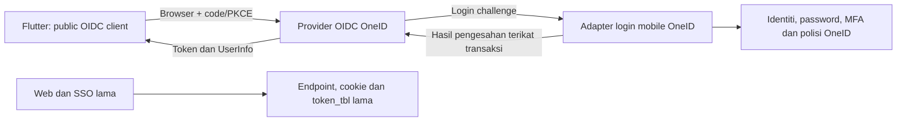

# Audit teknikal dan reka bentuk OneID Mobile OIDC

Tarikh: 29 September 2026. Baseline kod: `06f364d`, PHP CLI 8.3.33.

Status: audit kod dan reka bentuk awal selesai; belum pelaksanaan, belum production-ready. Semua endpoint, jadual dan nilai konfigurasi baharu di bawah ialah cadangan, bukan kemudahan yang sudah tersedia. Tiada login manusia, query database production, migration, perubahan konfigurasi, pemasangan provider atau deployment dilakukan dalam audit ini.

**Semakan kedua:** baca [Audit susulan dan daftar isu](Audit-Susulan-Kesediaan-Teknikal-OneID-Mobile.md). Semakan itu menambah bacaan agregat database melalui konfigurasi staging serta pemeriksaan konfigurasi server tempatan. Ia membetulkan andaian tentang MFA admin, peristiwa revocation, pengesahan token oleh SDK dan laluan `.well-known`. Pengasingan fizikal database staging/production belum dibuktikan; bacaan dibuat dalam transaksi READ ONLY tanpa mengeluarkan identiti pengguna.

## 1. Keperluan muktamad daripada pemilik sistem

- OneID sahaja mengesahkan staf dan pelajar. Tiada MyCampus, pemadanan akaun MyCampus, migrasi transaksi atau kelulusan aplikasi tambahan.
- Semua akaun staf/pelajar OneID aktif boleh masuk selepas semua langkah pengesahan yang diwajibkan selesai.
- Staf menggunakan nombor staf seperti `0530-09`; pelajar menggunakan nombor matrik. Individu yang mempunyai kedua-dua akaun boleh memilih akaun yang digunakan.
- Flutter menerima bukti pengesahan yang sah sebelum membuka dashboard. Pengesahan token bukan kelulusan akses tambahan.
- Sesi bertahan selepas aplikasi ditutup, dibuka semula atau telefon dimulakan semula. Pembatalan keselamatan/status akaun dan kehilangan credential peranti ialah pengecualian.
- Logout biasa hanya sesi pemasangan aplikasi/peranti berkenaan. Beberapa peranti dibenarkan.
- Login web, MFA dan SSO lama mesti mengekalkan tingkah laku sedia ada.

Penjelasan dalam perbualan mengatasi borang PDF: pilihan pengguna pradaftar, MyCampus dan sesi penggunaan semasa tidak lagi terpakai. Permintaan semua medan profil dalam PDF belum menjadi kontrak perkongsian yang diluluskan.

## 2. Bukti audit kod

| Bukti | Dapatan | Implikasi |
|---|---|---|
| `lib/Database.php:34`, `lib/auth_security.php:14` | Password diverifikasi dalam PHP; hash moden dan keserasian MD5 bersyarat; rehash boleh menulis semasa login | Guna pengesahan pusat; jangan eksport hash atau salin logik password ke Flutter |
| `lib/Database.php:69`, `lib/q_func.php` blok `auth` | Carian login mengikut `u_id`, `data2`, `data3`, `data8`; `data4` bukan fallback khusus dalam senarai itu | Login matrik mungkin melalui `u_id`; jangan anggap semua dataset sama |
| `lib/q_func.php:900` | Apabila `multi_session=0`, login password membatalkan token lama pengguna | Mengarahkan mobile terus melalui finalisasi lama boleh mengganggu sesi web |
| `app/Auth/MyDigitalId/MyDigitalIdLocalLoginFinalizer.php` | Finalizer MyDigital ID juga menulis token/cookie lama dan boleh membatalkan semua token | Jangan guna finalizer ini untuk mobile secara terus |
| `app/Auth/UserMfa/UserMfaPendingLoginCoordinator.php:208` | MFA finalize menerima `UserMfaLoginFinalizerInterface` | Ada titik sambungan untuk finalizer mobile; perlu ujian semantik transaksi dan pampasan |
| `app/Auth/UserMfa/LegacyUserMfaLoginFinalizer.php` | Finalizer sedia ada menulis `token_tbl` | Perlu finalizer mobile berasingan, bukan token SSO lama |
| `lib/q_func.php:214` dan seterusnya | HTTP boundary MFA menetapkan cookie serta sesi web selepas finalisasi | Reuse servis MFA sahaja tidak mencukupi; boundary mobile perlu berasingan |
| `app/Auth/UserSessionTimeoutPolicy.php` | Had mutlak browser 28,800 saat; default idle 1,800 saat | Jangan guna PHP browser session sebagai sesi persistent Flutter |
| `lib/Database.php:2044` | Token lama disimpan/dicari menggunakan hash dan akaun aktif diperiksa | Jadual ini bukan token store OAuth lengkap |
| `api.php` | API validasi SSO lama dengan `flag`, site credential, refresh legacy dan ACL | Kekalkan kontrak; bukan endpoint OIDC untuk mobile |
| `lib/integration_security.php` | Guard menyokong `observe` dan `enforce`, default kod observe | Jangan guna guard legacy sebagai satu-satunya perlindungan endpoint baharu |
| `app/User/UserPasswordChangeService.php` | Tukar password membatalkan token lama dan boleh membuat token pengganti | Sesi mobile memerlukan sambungan revocation tersendiri |
| `app/User/UserSecurityActionService.php`, `UserProfilePolicyService.php`, `UserAclManagementService.php` | Disable sebenar melalui SecurityActionService; perubahan kategori menggunakan label ACCOUNT_DISABLED; ACL menggunakan SECURITY_ACTION | Petakan peristiwa berdasarkan tindakan dan status sebenar, bukan label reason sahaja |
| `app/Auth/LogoutHandler.php` | Logout lama membatalkan token cookie dan memusnahkan PHP session | Logout mobile tidak memanggil handler ini |
| `lib/Database.php:1098`, `app/User/UserResyncService.php:14` | Profil `data1..data12` mempunyai pemetaan yang bergantung pada sumber/kategori | Gunakan allowlist claims dengan pemetaan eksplisit |
| `composer.json`, `app/Auth/MyDigitalId/MyDigitalIdProtocolClient.php` | Jumbojett ialah OIDC client untuk MyDigital ID | Kebergantungan ini tidak menjadikan OneID OIDC provider |
| `deployment/nginx/`, `deployment/README.md` | Template Nginx/PHP-FPM; webroot public dan runtime private | Konfigurasi yang dipasang di production belum disahkan |

Tiada AGENTS.md ditemui dalam carian workspace. Audit tidak membaca atau mendedahkan nilai secret runtime. Status MFA sebenar, multi_session production, topologi production dan akaun dwistatus belum disahkan melalui database.

## 3. Keputusan seni bina

Cadangan utama: provider OIDC berasingan di bawah operasi OneID, disambungkan kepada adapter pengesahan OneID. OneID kekal sumber akaun/password; tiada pendaftaran pengguna dalam provider kedua dan tiada eksport password.

Calon utama untuk proof of concept ialah **Ory Hydra self-hosted**, kerana model login/consent berasingan boleh disambungkan kepada identiti sedia ada. Ini pilihan seni bina, bukan keputusan versi/pemasangan production. Versi, lesen, operasi, sokongan database, pembaharuan refresh token dan hook status akaun perlu dibuktikan sebelum dipin.

Alternatif PHP `league/oauth2-server` menyediakan OAuth server tetapi tidak boleh dianggap penyelesaian OIDC lengkap tanpa menilai lapisan OIDC tambahan. Menulis sendiri issuer menggunakan `lib/stateless_jwt.php` tidak dipilih. Keycloak/federation ialah alternatif jika operasi organisasi sudah menyediakannya; audit ini tidak menemui bukti deployment tersebut.

Provider, database provider, kunci tandatangan dan private admin API diasingkan. Public issuer dan halaman login mobile menggunakan host khusus organisasi supaya cookie browser web tidak disentuh. Nama DNS sebenar ditentukan bersama infrastruktur. Provider admin API hanya boleh dicapai server adapter, bukan internet/Flutter.

Tidak memerlukan backend MyCampus atau backend aplikasi baharu semata-mata untuk native OIDC login. Jika aplikasi kemudian mempunyai API data terlindung, API itu mesti mengesahkan access token untuk audiennya; paparan dashboard Flutter sahaja bukan kawalan keselamatan server.

## 4. Sempadan pengesahan dan perlindungan flow lama

1. Tambah bootstrap/route mobile tersendiri; jangan memasukkan `lib/q_func.php` yang melaksanakan tindakan HTTP secara global.
2. Reuse verifier password, rate limit dan pembaca polisi. Adapter input mengekalkan nombor staf sebagai string, termasuk sifar dan tanda sempang. Kegagalan identiti/password memberi mesej umum.
3. Resolver staf/pelajar mesti mendapat satu akaun yang jelas. Lebih daripada satu padanan ialah kegagalan terkawal, bukan `LIMIT 1` sewenang-wenangnya. Jangan membezakan kategori melalui format input sahaja.
4. Selepas password betul, semak `avail_status`, polisi MFA semasa serta `password_change_required`. Jangan keluarkan kod/token selagi syarat pengesahan belum selesai.
5. Gunakan servis MFA sedia ada dengan boundary, session namespace, pending transaction dan finalizer mobile tersendiri. Finalizer menghasilkan authorization evidence tempatan, bukan `token_tbl` atau `sso_cre`.
6. Completion evidence sekali guna terikat pada user, login challenge, client, konteks akaun dan transaksi browser. Adapter memeriksa login challenge dengan provider melalui private API; tidak mempercayai user ID yang dihantar browser.
7. Selepas commit tempatan, adapter menerima challenge provider secara idempotent. Jika panggilan gagal, retry transaksi yang sama secara terkawal; jangan membenarkan replay MFA atau menebus evidence untuk client lain. Bukan panggilan rangkaian ketika memegang lock DB MFA.
8. Laluan tukar password wajib memerlukan adapter khusus atau aliran pemulihan yang kembali kepada login mobile secara selamat. Jangan memintas requirement, dan jangan memanggil finalizer yang mengeluarkan token web. Semantik pembatalan password sedia ada tetap terpakai.
9. Integrasi MyDigital ID dalam login mobile tidak diaktifkan secara automatik pada fasa pertama. Jika diperlukan kelak, perlu finalizer mobile dan ujian provider berasingan.
10. Semua branch legacy kekal default. Feature mobile OFF mesti menutup route mobile sahaja. Kegagalan provider tidak menjadi dependency untuk login lama.

Tiada jaminan sifar kesan sebelum regression dijalankan. Shared DB/MFA masih boleh berkongsi resource; tetapkan pool, timeout dan quota mobile supaya kegagalan mobile tidak menghabiskan sambungan untuk web.

## 5. Kontrak OIDC yang dicadangkan

Nilai URL diambil daripada discovery; bukan URL production yang dijanjikan. Jika Hydra dipilih, path provider sebenar disahkan semasa proof of concept.

| Operasi | Kontrak |
|---|---|
| Discovery | GET `/.well-known/openid-configuration`, issuer HTTPS tetap per environment |
| Authorization | `response_type=code`, client_id, redirect_uri berdaftar tepat, scope, state, nonce, challenge S256 |
| Token | POST form-urlencoded; authorization_code + code_verifier; refresh_token untuk pembaharuan |
| UserInfo | Bearer access token untuk profil minimum yang dibenarkan |
| JWKS | Public signing keys; rollover dengan overlap mengikut token yang masih sah |
| Revocation | Batalkan refresh/session pemasangan aplikasi, tidak logout web |
| Status mobile | Cadangan GET `/mobile/session` pada adapter; validate/introspect token, session mobile dan akaun aktif sebelum dashboard online |

Daftar empat public clients: Android UAT, iOS UAT, Android production, iOS production. `token_endpoint_auth_method=none`, PKCE S256 wajib, tanpa client secret dalam APK/IPA. Registration dikawal operator; tiada dynamic public registration.

Scope awal: `openid profile` dan keupayaan sesi refresh mengikut polisi provider (`offline_access` jika diperlukan). Tiada implicit flow atau password grant. First-party client boleh mendapat scope yang telah diluluskan tanpa skrin kelulusan pengguna tambahan, tertakluk pada aturan consent provider/OIDC. Ini bukan auto-approve scope arbitrari.

Kontrak integrasi memerlukan pengesahan issuer, audience/azp yang berkenaan, expiry, nonce dan state; UserInfo `sub` mesti sepadan dengan identiti yang disahkan. Jangan anggap library Flutter secara automatik memeriksa tandatangan JWT: AppAuth Android yang disemak menggunakan TLS token endpoint bagi code flow mengikut pilihan OIDC. Semak SDK/version kedua-dua platform dan buktikan validation path; jika reka bentuk memerlukan verifikasi tandatangan lokal, tambah verifier standard yang sesuai, bukan decode payload sahaja. ID token tidak menjadi access token API. Status endpoint OneID tetap memeriksa access token server-side.

Errors: `invalid_grant` bagi kod/refresh yang tidak sah; `invalid_client`, `invalid_scope`, `access_denied`, `login_required`, HTTP 429/503 mengikut boundary. Callback ke redirect yang tidak sah tidak dibenarkan. Ralat tidak memulangkan password, hash, raw token atau butiran akaun yang membolehkan enumeration.

## 6. Identiti dan profil minimum

`sub` ialah opaque stable identifier yang dipetakan kepada akaun OneID, bukan IC, email atau nombor yang mungkin digunakan semula. Pasangan issuer/sub ialah identiti kontrak. Kekalkan tombstone supaya akaun yang dipadam/dicipta semula tidak mewarisi subject lama secara tidak sengaja.

| Claim | Sumber / keputusan |
|---|---|
| sub | Pemetaan subject baharu kepada akaun OneID |
| name | `data1`, selepas normalisasi |
| preferred_username | Nombor staf/matrik yang sah untuk akaun berkenaan |
| account_type | `staff` atau `student`, daripada kategori/membership yang disahkan |
| staff_number | Untuk akaun staf; calon sumber `data3`, perlu sahkan dataset |
| student_number | Untuk akaun pelajar; calon `u_id`/`data4` mengikut provenance |
| email | Tidak wajib untuk login; hanya dengan scope dan keperluan dipersetujui |

Telefon, IC/pasport, program, PTJ dan data1..12 keseluruhan tidak dimasukkan secara default. Kekosongan medan pilihan tidak menggagalkan login akaun aktif. Jangan label `email_verified=true` tanpa bukti.

Dua akaun staf/pelajar berasingan menghasilkan dua subject berasingan. Jika satu akaun mempunyai dua membership, perlu tetapkan sama ada account context dipilih selepas pengesahan; tidak boleh menghasilkan kategori daripada nombor yang ditaip sahaja. Audit agregat read-only di UAT sebelum implementasi perlu memeriksa uniqueness nombor, kaitan u_id/data3/data4, kategori, membership dan potensi subject reuse tanpa mengeksport PII. Akaun ujian diperlukan untuk kes dual role.

## 7. Sesi berterusan dan revocation

Cadangan awal code TTL 60 saat, access token 5 minit, browser transaksi mobile 10 minit. Nilai ini tunable dan belum konfigurasi aktif. Jangan gunakan timeout PHP web 8 jam untuk refresh session.

Refresh token diputar setiap penggunaan dengan replay detection, diikat kepada client dan sesi pemasangan aplikasi; token yang disimpan server mesti dilindungi mengikut provider. Flutter menyimpan credential dalam Keychain/Keystore melalui library yang dinilai, bukan SharedPreferences/log. Pembaharuan mesti single-flight dan hasil baharu disimpan secara atomik. Lost response/concurrent refresh mesti diuji terhadap polisi grace provider; jangan longgarkan one-time rotation secara ad hoc.

Keperluan pemilik ialah tidak meminta login semula secara rutin. **Tiada TTL refresh yang diluluskan dalam audit ini.** Reka bentuk sasaran ialah renewal berterusan tanpa logout berkala bagi penggunaan biasa. RFC 9700 mengesyorkan expiry apabila lama tidak aktif; had tidak aktif/absolute ialah keputusan polisi yang masih terbuka. Jika pemilik memerlukan sesi walaupun berbulan-bulan tidak digunakan, sokongan provider dan pengecualian polisi itu mesti diputuskan secara eksplisit, bukan diam-diam menetapkan 30 hari atau menjanjikan token kekal selama-lamanya.

State Flutter: SIGNED_OUT → AUTHORIZING → ACTIVE; semasa app launch/resume: RESTORING → refresh jika perlu → status mobile → ACTIVE. Rangkaian gagal/503 menjadi TEMPORARILY_UNAVAILABLE, tidak memadam credential. `invalid_grant`/revoked menjadi REAUTH_REQUIRED. App close/restart bukan logout. Dashboard terlindung tidak dibuka berdasarkan boolean lokal sahaja.

Logout membuang sesi aktif lokal serta membatalkan token family peranti pada server. Jika rangkaian gagal, local logout tetap berlaku tetapi server revocation belum dapat dijamin; tentukan retry/pending revocation yang tidak boleh memulihkan sesi secara automatik. Jangan mendakwa offline logout membatalkan token server serta-merta. Login seterusnya boleh menawarkan pemilihan akaun supaya cookie browser provider tidak menyebabkan akaun lama dipilih tanpa disedari.

| Peristiwa | Tingkah laku mobile dicadangkan | Kesan legacy |
|---|---|---|
| Tutup app/restart telefon | Pulihkan sesi | Tiada |
| Login mobile pada peranti kedua | Kekalkan kedua-dua sesi | Tidak panggil pembatalan token web |
| Logout mobile | Batalkan family peranti itu | Cookie/token web tidak disentuh |
| Logout web biasa | Mobile kekal login | Tingkah laku lama kekal |
| Account disabled/deleted | Tolak status/profile dan refresh; revoke semua sesi mobile akaun | Tingkah laku lama kekal |
| Password change/reset | Cadangan revoke semua sesi mobile, selari tindakan keselamatan semasa | Jangan ubah revocation legacy |
| Admin revoke satu sesi web | Hanya sesi web berkenaan | Jangan diperluas secara senyap kepada mobile |
| Explicit revoke semua sesi akaun / kompromi | Revoke mobile dan legacy mengikut tindakan yang jelas | Audit sebab dan sasaran |
| Perubahan ACL web | Bukan syarat login mobile | Semantik ACL web kekal |

Account status perlu disemak pada authorization, refresh dan GET /mobile/session. Provider mesti membuktikan hook refresh untuk semakan current account/session atau mekanisme revocation sinkron yang setara. Jika provider hanya membaca status ketika login, proof of concept gagal syarat ini. Event revocation/outbox melengkapkan semakan semasa, bukan menggantikannya. Perubahan disable kemudian enable tidak boleh menghidupkan semula refresh family yang telah dibatalkan.

Access token yang diterima API secara offline mungkin sah sehingga TTL; status endpoint diperlukan pada app launch/resume, dan API terlindung masa hadapan perlu pemeriksaan sendiri. Tindakan disable tidak boleh dijamin memadam skrin yang sudah terbuka ketika tiada rangkaian.

## 8. Persistence dan fail yang dirancang

Provider mengurus schema authorization code/token/consent miliknya melalui migration rasmi. Jangan menduplikasi engine token dengan jadual buatan sendiri dalam OneID.

Cadangan jadual adapter baharu (reka bentuk logik, bukan SQL untuk dijalankan):

- `mobile_oidc_subjects`: subject unik, rujukan akaun, konteks jika diperlukan, lifecycle/tombstone.
- `mobile_oidc_transactions`: hash challenge, client, binding browser, expiry, auth_time, amr, status once-only, completion handle; tiada password/token mentah.
- `mobile_oidc_sessions`: session ID, subject, client, provider family reference, security version, status, sebab revocation, timestamps. Tiada hardware ID wajib.
- `mobile_oidc_account_security`: version per akaun untuk pembatalan serta recovery. Disable/reset menaikkan version dan tidak menurunkannya ketika enable semula.
- `mobile_oidc_outbox`: event revocation idempotent, attempt/retry/ack, minimum payload; reconcile dengan provider.

Cadangan lokasi: `app/Auth/MobileOidc/`, `public/auth/mobile/`, bootstrap mobile berasingan, template deployment issuer/adapter, migration baharu dan tests khusus. Semua nama cadangan, belum dicipta sebagai kod runtime.

Perubahan pada servis password/reset/disable untuk merekod event perlu dinilai setiap caller, termasuk sync dan admin. Semasa feature OFF, legacy kekal laluan asal. Semasa ON, invariant pembatalan mesti atomik dengan perubahan keselamatan atau fail closed bagi mobile. Sambungan rangkaian provider tidak boleh menyebabkan password change web tergantung; local security version + durable outbox menyediakan sempadan ini.

## 9. Pelaksanaan berfasa

| Fasa | Kerja | Syarat selesai |
|---|---|---|
| A: proof of concept terasing | Pilih/pin provider, semak lesen/runtime, fake identity, PKCE, refresh, revocation dan hook account status | Bukti provider memenuhi persistent session dan pengasingan; tiada pengguna sebenar |
| B: identity adapter | Resolver, password, MFA, forced change, rate limit, subject mapping; parity tests | Semua polisi pengesahan dipatuhi tanpa menulis token/cookie legacy |
| C: UAT dormant | Additive migration, feature OFF, issuer/client UAT, signing keys, private admin API | Baseline legacy sama sebelum/selepas migration |
| D: Flutter UAT | Callback, OIDC library, secure storage, session restoration, logout, error handling | Login staf/pelajar dan sesi selepas restart dibuktikan |
| E: pilot dan operasi | Test account security lifecycle, observability, restart/backup/restore dan rollback rehearsal | Semua acceptance tests lulus, callback/domain dan polisi sesi dimuktamadkan |
| F: production | Konfigurasi/client/kunci production berasingan dan rollout terkawal | Review hasil UAT dan arahan deployment; tiada andaian UAT awal Oktober boleh dijamin |

Feature flags cadangan: `ONEID_MOBILE_OIDC_ENABLED=false` dan konfigurasi issuer/provider private URL. Jangan guna flag baharu untuk mengubah `multi_session` global atau menaikkan timeout web.

## 10. Ujian penerimaan wajib sebelum production

- Legacy password login, invalid password, suspended user, forced change, email MFA/TOTP, MyDigital ID, callback aplikasi SSO, token refresh legacy, logout dan multisession kedua-dua mode.
- Web A kekal aktif selepas login/logout mobile B; login web tidak menghapus refresh mobile. Pastikan tiada perubahan `sso_cre`/PHP session web oleh route mobile.
- Mobile staf, pelajar, dua akaun satu individu, format `0530-09`, duplicate identifier, kategori tidak jelas, akaun tidak aktif dan tiada MyCampus.
- PKCE missing/plain/wrong verifier, code expiry/replay, callback mismatch, client silang, state/nonce mismatch, issuer/audience salah, signing key rotation, `sub` mismatch UserInfo.
- MFA belum selesai, OTP salah/expired/replay, forced password change, rate-limit dan maintenance tidak boleh dipintas oleh adapter.
- Refresh selepas kill/relaunch/reboot, concurrent refresh, response hilang, secure storage failure, app reinstall dan transient network error.
- Logout peranti A tidak logout B/web; revoke family digunakan semula; account disable/reset/admin revoke diikuti refresh; disable-enable tidak memulihkan sesi lama.
- Provider/adapter down tidak menjejaskan web; queue revocation gagal tidak membuka akses; migration rollback tidak memadam jadual legacy.

Baseline audit yang benar-benar dijalankan: `php tools/r52_pure_helpers.php` 28/28 lulus (helper sync sahaja); `php tests/characterization/as2_revoked_token_enforcement.php` 6/6 lulus (fake store pengesahan token). Ini bukan bukti end-to-end login production. Ujian yang mencipta DB/token dan authenticated login tidak dijalankan.

## 11. Rollback dan operasi

Sediakan snapshot konfigurasi dan backup schema/data sebelum rollout yang sebenar. Matikan entry mobile/clients dan token renewal untuk menghentikan integrasi; bagi emergency kompromi, revoke sesi mobile. Kekalkan tables/outbox bagi audit dan recovery, jangan drop semasa rollback biasa. Provider admin API kekal private, credentials/keyring di secret store; migration sahaja tidak mengaktifkan feature.

Rollback mobile tidak menukar endpoint `/api.php`, cookie web, token_tbl atau polisi multisession. Walau bagaimanapun perubahan sah password, status akaun dan rehash ketika pengguna login tidak dibalikkan. Pantau error login web berasingan daripada mobile, masa respons, refresh replay, queue lag dan connection pool. Jangan log raw authorization code, tokens, verifier, password atau IC.

## 12. Keputusan terbuka dan handover

Audit reka bentuk boleh disemak sekarang; perkara berikut ialah gate pelaksanaan/UAT, bukan alasan untuk mereka-reka nilai:

1. Provider/version yang lulus proof of concept, topologi/lesen/operasi dan hook refresh/account state.
2. DNS issuer/adapter, TLS, package ID, bundle ID dan callback Android/iOS UAT/production daripada infrastruktur/mobile.
3. Polisi refresh inactivity/absolute expiry yang memenuhi maksud kekal login, serta password reset revocation.
4. Pemetaan akaun dwistatus daripada semakan agregat dan akaun ujian; medan profil minimum sebenar.

Team Flutter boleh menyediakan UI, callback dan secure storage sementara fasa A berjalan. Tiada client secret native, API MyCampus, pendaftaran/kelulusan tambahan atau penghantaran password ke team developer diperlukan.

## Rujukan primer

- [OIDC Core](https://openid.net/specs/openid-connect-core-1_0.html): identiti, ID token, UserInfo dan pengesahan client.
- [RFC 8252](https://www.rfc-editor.org/rfc/rfc8252.html): native public clients, browser sistem dan PKCE.
- [RFC 7636](https://www.rfc-editor.org/rfc/rfc7636.html): verifier/challenge S256.
- [RFC 9700](https://www.rfc-editor.org/rfc/rfc9700.html): rotation/replay refresh token dan saranan expiry selepas inactivity.
- [Ory login/consent integration](https://www.ory.com/docs/oauth2-oidc/custom-login-consent/flow): provider menyerahkan pengesahan kepada aplikasi identiti sedia ada. Kesesuaian khusus OneID ialah kesimpulan reka bentuk audit ini, belum dibuktikan melalui deployment.
- [League OAuth2 Server](https://oauth2.thephpleague.com/): library OAuth2 untuk PHP; tidak dianggap bukti OIDC end-to-end tanpa penilaian tambahan.
