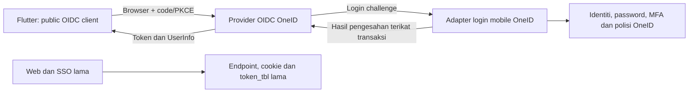

# Dokumen Induk Analisis Teknikal dan Kontrak Integrasi OneID–Mobile

Versi 1.0 • 29 September 2026 • Projek OneID UAT • Baseline kod 06f364d

Status: dokumen reka bentuk untuk semakan dan proof of concept. Bukan pengesahan kesiapsiagaan production. Endpoint, client ID, konfigurasi token, schema dan contoh payload dalam dokumen ini belum dilaksanakan atau diterbitkan.

## Tujuan dan pembaca

Dokumen ini menyatukan semua hasil analisis teknikal yang telah dibuat, termasuk dapatan kod, agregat staging, risiko, reka bentuk, ujian, rollback serta kontrak yang OneID akan sediakan untuk team Flutter. Pembaca: pemilik OneID, developer OneID, team mobile dan infrastruktur.

## Susunan dokumen

- Bahagian A: skop yang disahkan dan apa OneID akan sediakan kepada mobile apps.
- Bahagian B: kontrak integrasi cadangan, sesi, ralat, pembahagian kerja dan handover.
- Lampiran 1: audit teknikal serta reka bentuk awal, dimasukkan sepenuhnya.
- Lampiran 2: audit susulan, 16 isu dan tujuh gate kesediaan, dimasukkan sepenuhnya.

Penjelasan terkini pemilik mengatasi borang jawapan asal. Audit susulan memperincikan atau membetulkan andaian audit awal; sebarang konflik hendaklah merujuk audit susulan dan kontrak dalam Bahagian B. Nilai cadangan tidak dianggap polisi yang diluluskan hanya kerana tercatat dalam dokumen.

# Bahagian A — Skop dan perkhidmatan OneID

## A1. Skop fungsi yang telah disahkan

OneID ialah sumber tunggal pengesahan. Semua akaun staf/pelajar aktif yang melengkapkan pengesahan OneID boleh terus masuk ke mobile apps. Tiada MyCampus, pemadanan akaun luar, pendaftaran tambahan atau kelulusan akses berasingan.

Staf login dengan nombor staf seperti 0530-09 dan pelajar dengan nombor matrik. Individu yang mempunyai akaun staf dan pelajar boleh memilih akaun yang digunakan. Struktur akaun dwistatus sebenar masih perlu dibuktikan dengan akaun ujian.

Flutter membuka dashboard selepas menerima dan mengesahkan bukti login serta status sesi daripada OneID. Semakan itu bukan kelulusan akses tambahan. Tutup aplikasi atau restart telefon tidak bermaksud logout. Pengecualian: sesi dibatalkan, akaun tidak lagi aktif atau credential sesi tidak lagi boleh digunakan.

Login web dan SSO sedia ada mesti kekal berfungsi. Tiada perubahan runtime dibuat semasa kedua-dua audit.

## A2. Apa OneID akan provide

| Perkhidmatan / bahan | Apa mobile apps gunakan | Status sekarang |
|---|---|---|
| Hosted login OneID | Browser sistem memaparkan login nombor staf/matrik dan password | Login web ada; adapter mobile baharu belum dibina |
| MFA dan forced password change | Pengguna melengkapkan proses pada halaman OneID sebelum kembali ke Flutter | Servis asas ada; boundary mobile belum dibina |
| Issuer dan discovery URL | Library Flutter membaca konfigurasi OIDC yang dipercayai | Belum disediakan |
| Client ID setiap platform/environment | Mengenal pasti aplikasi Android/iOS UAT/production | Belum didaftarkan; public client tanpa secret dalam aplikasi |
| Authorization endpoint | Memulakan login Authorization Code + PKCE S256 | Belum disediakan |
| Token endpoint | Menukar kod kepada token dan memperbaharui sesi | Belum disediakan |
| ID token | Identiti yang disahkan untuk client berkenaan | Kontrak dicadangkan |
| Access token | Memanggil UserInfo/status sesi yang dibenarkan | Kontrak audience/scope perlu dibuktikan dengan provider |
| Refresh token | Mengekalkan sesi tanpa menaip password setiap kali buka aplikasi | Rotation dan polisi expiry belum dimuktamadkan |
| UserInfo | Profil minimum berdasarkan scope yang diluluskan | Pemetaan sedia ada perlu adapter allowlist |
| Status sesi mobile | Semak sesi dan status akaun semasa pada app launch/resume | Endpoint adapter baharu dicadangkan |
| Revocation/logout peranti | Menamatkan sesi pemasangan aplikasi itu sahaja | Semantik family/provider perlu PoC |
| Discovery/JWKS | Metadata dan public key verification | Belum diterbitkan |
| Dokumentasi dan test pack | Panduan konfigurasi, contoh ralat, akaun ujian dan acceptance cases | Analisis tersedia; test account/build belum disediakan |

OneID tidak akan memberi password, hash password, secret MFA, private signing key atau akses terus database kepada aplikasi. Client ID bukan password dan bukan rahsia. Private provider admin API hanya digunakan server OneID.

## A3. Apa yang tidak termasuk dalam jaminan pengesahan ini

Login OneID mengesahkan identiti dan status sesi. Ia tidak membina fungsi perniagaan mobile, menyimpan transaksi aplikasi atau melindungi API luar secara automatik. Jika aplikasi kemudian memanggil API data terlindung, API itu mesti mengesahkan token untuk audiennya sendiri. Ini kawalan teknikal, bukan proses kelulusan pengguna baharu.

# Bahagian B — Kontrak integrasi cadangan

## B1. Konfigurasi yang akan diserahkan

| Item | Nilai / bentuk yang dicadangkan | Pihak yang menetapkan |
|---|---|---|
| Issuer UAT dan production | HTTPS URL tetap dan berasingan; belum ditentukan | OneID + infrastruktur |
| Discovery URL | {issuer}/.well-known/openid-configuration | OneID |
| Client ID | Satu bagi Android/iOS untuk setiap environment | OneID selepas terima ID aplikasi |
| Redirect URI | Alamat tepat, tiada wildcard; dikaitkan dengan app links atau kaedah callback dipersetujui | Flutter + infrastruktur, didaftarkan OneID |
| Client authentication | none bagi public native client; tiada secret tertanam | OneID |
| Grant types | authorization_code dan refresh_token | OneID |
| PKCE | S256 wajib | OneID + Flutter |
| Scopes | openid, profile, mobile:session; offline_access mengikut provider/polisi | OneID; masih cadangan |
| Status endpoint audience | oneid-mobile-session, nama logik cadangan | OneID |
| Token/code lifetime | Cadangan code 60s, access token 5 minit; refresh belum diputuskan | OneID/pemilik |
| Response dan error schema | Versi kontrak serta contoh dalam dokumen ini | OneID + Flutter |

Jangan hardcode URL contoh atau anggap endpoint mempunyai path tertentu sebelum provider dipilih. Flutter menggunakan discovery dari issuer yang ditetapkan dalam konfigurasi build dipercayai, bukan URL bebas daripada callback/pengguna. Kontrak audien bagi UserInfo dan status adapter perlu disahkan; jangan anggap satu token untuk semua API tanpa pendaftaran provider yang betul.

## B2. Aliran login pertama

1. Flutter memulakan satu transaksi login dan menjana state, nonce serta PKCE verifier/challenge melalui library yang dinilai.
2. Browser pengesahan sistem membuka authorization endpoint OneID.
3. Provider menghantar transaksi kepada hosted adapter OneID. Adapter memeriksa client/challenge yang sah sebelum menerima credential pengguna.
4. OneID mengesahkan password, status akaun, MFA mengikut polisi sebenar dan kewajipan tukar password.
5. OneID hanya melengkapkan authorization selepas semua syarat selesai. Client yang dipercayai mendapat scope yang diluluskan tanpa kelulusan akses pengguna tambahan, mengikut mekanisme provider.
6. Callback membawa authorization code dan state, bukan password atau token dalam URL.
7. Flutter menukar kod dengan verifier kepada token. Kod sekali guna, terikat kepada client dan redirect URI.
8. Flutter mengesahkan respons OIDC mengikut kontrak SDK; kemudian memanggil status sesi dengan access token.
9. Jika status sah, Flutter memaparkan dashboard. Tiada panggilan MyCampus atau pendaftaran akaun tambahan.

Browser dibatalkan pengguna ialah cancellation, bukan invalid password. App process mati ketika browser masih terbuka mesti mempunyai tingkah laku resume/restart yang diuji; jangan menebus kod dengan verifier yang berbeza.

## B3. Token yang disediakan

| Token | Fungsi | Cara digunakan |
|---|---|---|
| ID token | Bukti identiti, issuer, client audience, masa dan konteks auth | Validasi mengikut OIDC; bukan bearer token untuk semua API |
| Access token | Akses kepada resource yang diperuntukkan | Authorization: Bearer; format opaque/JWT ikut provider, jangan andaikan boleh decode |
| Refresh token | Mendapatkan token seterusnya tanpa login interaktif rutin | Token endpoint; secure storage; rotation dan single-flight |

Contoh bentuk respons token — semua nilai contoh, bukan token sah:

```json
{
  "token_type": "Bearer",
  "expires_in": 300,
  "access_token": "<access-token>",
  "id_token": "<id-token>",
  "refresh_token": "<refresh-token>",
  "scope": "openid profile mobile:session offline_access"
}
```

Refresh response mungkin tidak mengandungi ID token baharu. Refresh token baharu yang diterima menggantikan token lama secara atomik; pengendalian ketiadaan token baharu mesti mengikuti kontrak provider yang telah diuji. Tamat ID token lama tidak bermaksud sesi refresh semestinya tamat.

SDK Flutter/native tidak boleh dianggap membuat semua jenis verifikasi JWT secara automatik. Audit susulan menjelaskan AppAuth Android menggunakan pilihan validasi TLS bagi token yang diterima terus melalui code flow. Verifikasi claims dan signature jika diperlukan oleh kontrak mesti dibuktikan pada versi Android/iOS yang dipin.

## B4. Profil yang boleh diterima Flutter

| Claim | Tujuan | Keputusan reka bentuk |
|---|---|---|
| sub | ID stabil akaun; digunakan bersama issuer | Wajib; opaque mapping baharu, bukan IC |
| name | Nama pada dashboard | Daripada profil OneID; tiada export keseluruhan row |
| preferred_username | Nombor login yang sesuai | Nombor staf/matrik sebagai string |
| account_type | Konteks staf atau pelajar | staff/student daripada pemetaan yang disahkan |
| staff_number | Rujukan staf | Hanya jika akaun staf dan diperlukan |
| student_number | Rujukan pelajar | Hanya jika akaun pelajar dan diperlukan |
| email | Maklumat hubungan | Pilihan, hanya dengan scope/keperluan dipersetujui |
| auth_time / amr | Masa dan kaedah auth | Dalam token jika bukti tersedia; jangan mereka-reka MFA claim |

Contoh UserInfo staf, bukan data sebenar:

```json
{
  "sub": "opaque-subject-example",
  "name": "Nama Contoh",
  "preferred_username": "0530-09",
  "account_type": "staff",
  "staff_number": "0530-09"
}
```

Bagi pelajar, konteks ialah student dan student_number digunakan. Medan yang tidak berkaitan diabaikan; jangan mewajibkan staf mempunyai matrik atau pelajar mempunyai nombor staf. ID stabil jangan ditukar hanya kerana nombor/email profil berubah. Akaun dipadam dan dicipta semula tidak boleh mewarisi sesi/sub lama secara tidak sengaja.

Nombor telefon, IC/pasport, PTJ/program dan medan tambahan yang ditandakan wajib dalam borang asal belum diluluskan sebagai kontrak minimum login. OneID perlu mengesahkan sumber, tujuan dan kebenaran sebelum menambah scope. Ketiadaan email pilihan tidak boleh menggagalkan login akaun aktif.

## B5. Status sesi mobile

Cadangan GET /mobile/session pada host adapter OneID, path sebenar akan diterbitkan bersama kontrak versi 1. Request menggunakan access token; Flutter tidak menghantar user ID bebas untuk menentukan akaun yang hendak disahkan.

Adapter memeriksa token aktif, issuer/introspection yang dipercayai, expiry, audience, scope, client berdaftar, subject, session reference dan security version akaun. Semua ini semakan bukti/status OneID, bukan kelulusan aplikasi tambahan.

Contoh respons 200:

```json
{
  "session_status": "active",
  "user": {
    "sub": "opaque-subject-example",
    "account_type": "staff",
    "name": "Nama Contoh"
  },
  "request_id": "correlation-example"
}
```

Jangan expose refresh token/provider admin session ID dalam respons status. Jika bergantung pada cache, had cache dan tingkah laku dependency failure mesti jelas; jangan pulangkan active tanpa semakan yang memenuhi kontrak. Status mobile bukan pengganti pengesahan API data jika API data ditambah kemudian.

## B6. Kekal login dan pemulihan sesi

Flutter: app launch/resume → baca secure storage → refresh jika perlu → semak status OneID → dashboard. Tutup app dan restart telefon tidak membuang sesi.

OneID: refresh rotation, status akaun semasa, revocation, penyimpanan state persistent serta key rotation tanpa memutuskan sesi secara tidak sengaja. Flutter: secure storage, atomic update, single-flight refresh dan generation counter untuk menghalang response lama selepas logout/account switch.

Kegagalan rangkaian/503 tidak memadam token. Paparkan keadaan sementara dan retry terkawal; jangan buka akses online tanpa pemeriksaan yang diperlukan. Akaun dibatalkan/refresh invalid menyebabkan reauthentication atau mesej akaun tidak tersedia.

Pemilik meminta tiada logout rutin. Tempoh tidak aktif/absolute refresh belum ditetapkan dan tidak boleh diputuskan secara senyap oleh default provider. Kekal login tidak bermaksud akaun digantung mesti terus dibenarkan. Ujian operasi panjang perlu membuktikan behaviour, bukan hanya login sekali.

## B7. Logout dan pemilihan akaun

Logout biasa: Flutter menandakan state signed-out, menghentikan refresh dan request lama, meminta pembatalan family sesi peranti, membuang token/profil/cache lokal. Peranti lain dan sesi web tidak dibatalkan oleh logout biasa.

Revocation endpoint RFC/provider dan token-family semantics masih perlu PoC. OAuth end-session browser tidak sama dengan revoke refresh family; jangan guna salah satunya sebagai pengganti automatik. Sesi provider browser boleh kekal, tetapi aplikasi tidak memulakan login semula tanpa tindakan pengguna selepas logout. Login seterusnya perlu menyediakan pemilihan akaun/konteks yang betul.

Jika logout ketika offline, logout lokal tetap berlaku tetapi server belum menerima pembatalan. Mekanisme retry tidak boleh menghidupkan semula sesi. Uninstall/backup restore mempunyai tingkah laku platform berbeza dan perlu diuji.

## B8. Kontrak ralat dan tindakan Flutter

Kod domain di bawah ialah cadangan kontrak, bukan endpoint aktif. OAuth token errors kekal standard provider; jangan menukar semua ralat menjadi invalid_grant.

| Kejadian | Bentuk respons / status | Tindakan Flutter |
|---|---|---|
| Pengguna tutup browser | Cancellation daripada SDK | Kembali ke skrin login tanpa mesej password salah |
| Password/MFA salah | Hosted UI OneID; tiada token berjaya | Pengguna melengkapkan pengesahan pada OneID |
| Wajib tukar password | Hosted UI OneID; authorization belum lengkap | Jangan buka dashboard dahulu |
| Kod/refresh invalid atau replay | OAuth invalid_grant | Hentikan sesi yang tidak boleh dipulihkan dan minta login |
| Client/callback tidak sah | invalid_client / invalid_request mengikut endpoint | Laporkan konfigurasi; jangan retry tanpa had |
| Token status tidak sah | HTTP 401, SESSION_INVALID | Refresh sekali jika sesuai; jika tetap gagal, reauth |
| Akaun tidak tersedia | HTTP 403, ACCOUNT_UNAVAILABLE selepas identiti token disahkan | Hentikan akses, paparkan mesej dan rujukan sokongan |
| Had request | HTTP 429 dengan retry guidance | Backoff; jangan padam credential secara automatik |
| Maintenance/dependency gagal | HTTP 503, SERVICE_UNAVAILABLE | Kekalkan credential, tunjuk keadaan sementara |
| Tiada internet / timeout | Ralat transport, bukan revoked | Retry terkawal, elakkan loop login |

Contoh ralat endpoint adapter:

```json
{
  "error": "SERVICE_UNAVAILABLE",
  "message": "Pengesahan sesi tidak tersedia buat sementara waktu.",
  "request_id": "correlation-example"
}
```

Error response dan log tidak mengandungi password, token mentah, verifier atau IC. Request ID digunakan team sokongan untuk menjejak masalah tanpa pengguna menyerahkan credential.

## B9. Pembahagian tanggungjawab

| OneID | Flutter | Infrastruktur |
|---|---|---|
| Identity resolver dan polisi auth | Browser flow, PKCE/state/nonce | DNS/TLS dan routing |
| Provider, hook dan session status | Validation SDK dan secure storage | Provider runtime dan private admin network |
| Subject/profil allowlist | Session restoration dan logout UI | Pool, DB isolation dan kapasiti |
| Refresh/revocation lifecycle | Single-flight, retry dan account switch | Backup/restore dan monitoring |
| Test accounts dan error contract | Build Android/iOS sebenar | App-link association hosting |

## B10. Pakej handover OneID kepada team mobile

- Integration configuration UAT dan production yang berasingan: issuer, discovery, client IDs, callback, scopes, audience dan status/revocation URLs.
- Kontrak API machine-readable bagi endpoint custom seperti /mobile/session (OpenAPI selepas path/schema dimuktamadkan); discovery OIDC daripada provider untuk endpoint standard.
- Sequence login, refresh, logout dan account-switch; contoh payload menggunakan placeholder sahaja.
- Polisi code/token/refresh dan tindakan bagi network failure, invalid_grant, disable, reset password serta perubahan MFA.
- Akaun ujian melalui saluran terkawal untuk staf, pelajar, admin-staf, forced change, MFA dan dwistatus; tiada credential dalam Git/dokumen umum.
- Test cases, hasil regression serta acceptance sign-off OneID/Flutter/infrastruktur.
- Panduan troubleshooting menggunakan request ID dan PIC operasi.

Pakej ini ialah deliverable yang perlu dibina, bukan semua telah tersedia sekarang.

## B11. Bukti dan batas kesediaan

74 semakan baseline daripada dua audit lulus (34 audit pertama, 40 audit kedua). Ia helper/fixture, bukan pengesahan OIDC–Flutter end-to-end. Pemeriksaan staging mengambil agregat read-only dan konfigurasi tempatan; belum ada bukti production equivalence atau pemisahan fizikal DB.

Urutan seterusnya: proof of concept provider terasing → adapter auth/identity → UAT dormant → integrasi Flutter → ujian gabungan dan failure injection → review rollout. Tujuh gate kesediaan serta 16 isu penuh terkandung dalam Lampiran 2. Tiada pemasangan provider atau deployment diluluskan secara tersirat oleh dokumen ini.


# Lampiran 1 — Audit teknikal dan reka bentuk awal

# Audit teknikal dan reka bentuk OneID Mobile OIDC

Tarikh: 29 September 2026. Baseline kod: `06f364d`, PHP CLI 8.3.33.

Status: audit kod dan reka bentuk awal selesai; belum pelaksanaan, belum production-ready. Semua endpoint, jadual dan nilai konfigurasi baharu di bawah ialah cadangan, bukan kemudahan yang sudah tersedia. Tiada login manusia, query database production, migration, perubahan konfigurasi, pemasangan provider atau deployment dilakukan dalam audit ini.

**Semakan kedua:** baca [Audit susulan dan daftar isu](Audit-Susulan-Kesediaan-Teknikal-OneID-Mobile.md). Semakan itu menambah bacaan agregat database melalui konfigurasi staging serta pemeriksaan konfigurasi server tempatan. Ia membetulkan andaian tentang MFA admin, peristiwa revocation, pengesahan token oleh SDK dan laluan `.well-known`. Pengasingan fizikal database staging/production belum dibuktikan; bacaan dibuat dalam transaksi READ ONLY tanpa mengeluarkan identiti pengguna.

## 1. Keperluan muktamad daripada pemilik sistem

- OneID sahaja mengesahkan staf dan pelajar. Tiada MyCampus, pemadanan akaun MyCampus, migrasi transaksi atau kelulusan aplikasi tambahan.
- Semua akaun staf/pelajar OneID aktif boleh masuk selepas semua langkah pengesahan yang diwajibkan selesai.
- Staf menggunakan nombor staf seperti `0530-09`; pelajar menggunakan nombor matrik. Individu yang mempunyai kedua-dua akaun boleh memilih akaun yang digunakan.
- Flutter menerima bukti pengesahan yang sah sebelum membuka dashboard. Pengesahan token bukan kelulusan akses tambahan.
- Sesi bertahan selepas aplikasi ditutup, dibuka semula atau telefon dimulakan semula. Pembatalan keselamatan/status akaun dan kehilangan credential peranti ialah pengecualian.
- Logout biasa hanya sesi pemasangan aplikasi/peranti berkenaan. Beberapa peranti dibenarkan.
- Login web, MFA dan SSO lama mesti mengekalkan tingkah laku sedia ada.

Penjelasan dalam perbualan mengatasi borang PDF: pilihan pengguna pradaftar, MyCampus dan sesi penggunaan semasa tidak lagi terpakai. Permintaan semua medan profil dalam PDF belum menjadi kontrak perkongsian yang diluluskan.

## 2. Bukti audit kod

| Bukti | Dapatan | Implikasi |
|---|---|---|
| `lib/Database.php:34`, `lib/auth_security.php:14` | Password diverifikasi dalam PHP; hash moden dan keserasian MD5 bersyarat; rehash boleh menulis semasa login | Guna pengesahan pusat; jangan eksport hash atau salin logik password ke Flutter |
| `lib/Database.php:69`, `lib/q_func.php` blok `auth` | Carian login mengikut `u_id`, `data2`, `data3`, `data8`; `data4` bukan fallback khusus dalam senarai itu | Login matrik mungkin melalui `u_id`; jangan anggap semua dataset sama |
| `lib/q_func.php:900` | Apabila `multi_session=0`, login password membatalkan token lama pengguna | Mengarahkan mobile terus melalui finalisasi lama boleh mengganggu sesi web |
| `app/Auth/MyDigitalId/MyDigitalIdLocalLoginFinalizer.php` | Finalizer MyDigital ID juga menulis token/cookie lama dan boleh membatalkan semua token | Jangan guna finalizer ini untuk mobile secara terus |
| `app/Auth/UserMfa/UserMfaPendingLoginCoordinator.php:208` | MFA finalize menerima `UserMfaLoginFinalizerInterface` | Ada titik sambungan untuk finalizer mobile; perlu ujian semantik transaksi dan pampasan |
| `app/Auth/UserMfa/LegacyUserMfaLoginFinalizer.php` | Finalizer sedia ada menulis `token_tbl` | Perlu finalizer mobile berasingan, bukan token SSO lama |
| `lib/q_func.php:214` dan seterusnya | HTTP boundary MFA menetapkan cookie serta sesi web selepas finalisasi | Reuse servis MFA sahaja tidak mencukupi; boundary mobile perlu berasingan |
| `app/Auth/UserSessionTimeoutPolicy.php` | Had mutlak browser 28,800 saat; default idle 1,800 saat | Jangan guna PHP browser session sebagai sesi persistent Flutter |
| `lib/Database.php:2044` | Token lama disimpan/dicari menggunakan hash dan akaun aktif diperiksa | Jadual ini bukan token store OAuth lengkap |
| `api.php` | API validasi SSO lama dengan `flag`, site credential, refresh legacy dan ACL | Kekalkan kontrak; bukan endpoint OIDC untuk mobile |
| `lib/integration_security.php` | Guard menyokong `observe` dan `enforce`, default kod observe | Jangan guna guard legacy sebagai satu-satunya perlindungan endpoint baharu |
| `app/User/UserPasswordChangeService.php` | Tukar password membatalkan token lama dan boleh membuat token pengganti | Sesi mobile memerlukan sambungan revocation tersendiri |
| `app/User/UserSecurityActionService.php`, `UserProfilePolicyService.php`, `UserAclManagementService.php` | Disable sebenar melalui SecurityActionService; perubahan kategori menggunakan label ACCOUNT_DISABLED; ACL menggunakan SECURITY_ACTION | Petakan peristiwa berdasarkan tindakan dan status sebenar, bukan label reason sahaja |
| `app/Auth/LogoutHandler.php` | Logout lama membatalkan token cookie dan memusnahkan PHP session | Logout mobile tidak memanggil handler ini |
| `lib/Database.php:1098`, `app/User/UserResyncService.php:14` | Profil `data1..data12` mempunyai pemetaan yang bergantung pada sumber/kategori | Gunakan allowlist claims dengan pemetaan eksplisit |
| `composer.json`, `app/Auth/MyDigitalId/MyDigitalIdProtocolClient.php` | Jumbojett ialah OIDC client untuk MyDigital ID | Kebergantungan ini tidak menjadikan OneID OIDC provider |
| `deployment/nginx/`, `deployment/README.md` | Template Nginx/PHP-FPM; webroot public dan runtime private | Konfigurasi yang dipasang di production belum disahkan |

Tiada AGENTS.md ditemui dalam carian workspace. Audit tidak membaca atau mendedahkan nilai secret runtime. Status MFA sebenar, multi_session production, topologi production dan akaun dwistatus belum disahkan melalui database.

## 3. Keputusan seni bina

Cadangan utama: provider OIDC berasingan di bawah operasi OneID, disambungkan kepada adapter pengesahan OneID. OneID kekal sumber akaun/password; tiada pendaftaran pengguna dalam provider kedua dan tiada eksport password.

Calon utama untuk proof of concept ialah **Ory Hydra self-hosted**, kerana model login/consent berasingan boleh disambungkan kepada identiti sedia ada. Ini pilihan seni bina, bukan keputusan versi/pemasangan production. Versi, lesen, operasi, sokongan database, pembaharuan refresh token dan hook status akaun perlu dibuktikan sebelum dipin.

Alternatif PHP `league/oauth2-server` menyediakan OAuth server tetapi tidak boleh dianggap penyelesaian OIDC lengkap tanpa menilai lapisan OIDC tambahan. Menulis sendiri issuer menggunakan `lib/stateless_jwt.php` tidak dipilih. Keycloak/federation ialah alternatif jika operasi organisasi sudah menyediakannya; audit ini tidak menemui bukti deployment tersebut.

Provider, database provider, kunci tandatangan dan private admin API diasingkan. Public issuer dan halaman login mobile menggunakan host khusus organisasi supaya cookie browser web tidak disentuh. Nama DNS sebenar ditentukan bersama infrastruktur. Provider admin API hanya boleh dicapai server adapter, bukan internet/Flutter.



Tidak memerlukan backend MyCampus atau backend aplikasi baharu semata-mata untuk native OIDC login. Jika aplikasi kemudian mempunyai API data terlindung, API itu mesti mengesahkan access token untuk audiennya; paparan dashboard Flutter sahaja bukan kawalan keselamatan server.

## 4. Sempadan pengesahan dan perlindungan flow lama

1. Tambah bootstrap/route mobile tersendiri; jangan memasukkan `lib/q_func.php` yang melaksanakan tindakan HTTP secara global.
2. Reuse verifier password, rate limit dan pembaca polisi. Adapter input mengekalkan nombor staf sebagai string, termasuk sifar dan tanda sempang. Kegagalan identiti/password memberi mesej umum.
3. Resolver staf/pelajar mesti mendapat satu akaun yang jelas. Lebih daripada satu padanan ialah kegagalan terkawal, bukan `LIMIT 1` sewenang-wenangnya. Jangan membezakan kategori melalui format input sahaja.
4. Selepas password betul, semak `avail_status`, polisi MFA semasa serta `password_change_required`. Jangan keluarkan kod/token selagi syarat pengesahan belum selesai.
5. Gunakan servis MFA sedia ada dengan boundary, session namespace, pending transaction dan finalizer mobile tersendiri. Finalizer menghasilkan authorization evidence tempatan, bukan `token_tbl` atau `sso_cre`.
6. Completion evidence sekali guna terikat pada user, login challenge, client, konteks akaun dan transaksi browser. Adapter memeriksa login challenge dengan provider melalui private API; tidak mempercayai user ID yang dihantar browser.
7. Selepas commit tempatan, adapter menerima challenge provider secara idempotent. Jika panggilan gagal, retry transaksi yang sama secara terkawal; jangan membenarkan replay MFA atau menebus evidence untuk client lain. Bukan panggilan rangkaian ketika memegang lock DB MFA.
8. Laluan tukar password wajib memerlukan adapter khusus atau aliran pemulihan yang kembali kepada login mobile secara selamat. Jangan memintas requirement, dan jangan memanggil finalizer yang mengeluarkan token web. Semantik pembatalan password sedia ada tetap terpakai.
9. Integrasi MyDigital ID dalam login mobile tidak diaktifkan secara automatik pada fasa pertama. Jika diperlukan kelak, perlu finalizer mobile dan ujian provider berasingan.
10. Semua branch legacy kekal default. Feature mobile OFF mesti menutup route mobile sahaja. Kegagalan provider tidak menjadi dependency untuk login lama.

Tiada jaminan sifar kesan sebelum regression dijalankan. Shared DB/MFA masih boleh berkongsi resource; tetapkan pool, timeout dan quota mobile supaya kegagalan mobile tidak menghabiskan sambungan untuk web.

## 5. Kontrak OIDC yang dicadangkan

Nilai URL diambil daripada discovery; bukan URL production yang dijanjikan. Jika Hydra dipilih, path provider sebenar disahkan semasa proof of concept.

| Operasi | Kontrak |
|---|---|
| Discovery | GET `/.well-known/openid-configuration`, issuer HTTPS tetap per environment |
| Authorization | `response_type=code`, client_id, redirect_uri berdaftar tepat, scope, state, nonce, challenge S256 |
| Token | POST form-urlencoded; authorization_code + code_verifier; refresh_token untuk pembaharuan |
| UserInfo | Bearer access token untuk profil minimum yang dibenarkan |
| JWKS | Public signing keys; rollover dengan overlap mengikut token yang masih sah |
| Revocation | Batalkan refresh/session pemasangan aplikasi, tidak logout web |
| Status mobile | Cadangan GET `/mobile/session` pada adapter; validate/introspect token, session mobile dan akaun aktif sebelum dashboard online |

Daftar empat public clients: Android UAT, iOS UAT, Android production, iOS production. `token_endpoint_auth_method=none`, PKCE S256 wajib, tanpa client secret dalam APK/IPA. Registration dikawal operator; tiada dynamic public registration.

Scope awal: `openid profile` dan keupayaan sesi refresh mengikut polisi provider (`offline_access` jika diperlukan). Tiada implicit flow atau password grant. First-party client boleh mendapat scope yang telah diluluskan tanpa skrin kelulusan pengguna tambahan, tertakluk pada aturan consent provider/OIDC. Ini bukan auto-approve scope arbitrari.

Kontrak integrasi memerlukan pengesahan issuer, audience/azp yang berkenaan, expiry, nonce dan state; UserInfo `sub` mesti sepadan dengan identiti yang disahkan. Jangan anggap library Flutter secara automatik memeriksa tandatangan JWT: AppAuth Android yang disemak menggunakan TLS token endpoint bagi code flow mengikut pilihan OIDC. Semak SDK/version kedua-dua platform dan buktikan validation path; jika reka bentuk memerlukan verifikasi tandatangan lokal, tambah verifier standard yang sesuai, bukan decode payload sahaja. ID token tidak menjadi access token API. Status endpoint OneID tetap memeriksa access token server-side.

Errors: `invalid_grant` bagi kod/refresh yang tidak sah; `invalid_client`, `invalid_scope`, `access_denied`, `login_required`, HTTP 429/503 mengikut boundary. Callback ke redirect yang tidak sah tidak dibenarkan. Ralat tidak memulangkan password, hash, raw token atau butiran akaun yang membolehkan enumeration.

## 6. Identiti dan profil minimum

`sub` ialah opaque stable identifier yang dipetakan kepada akaun OneID, bukan IC, email atau nombor yang mungkin digunakan semula. Pasangan issuer/sub ialah identiti kontrak. Kekalkan tombstone supaya akaun yang dipadam/dicipta semula tidak mewarisi subject lama secara tidak sengaja.

| Claim | Sumber / keputusan |
|---|---|
| sub | Pemetaan subject baharu kepada akaun OneID |
| name | `data1`, selepas normalisasi |
| preferred_username | Nombor staf/matrik yang sah untuk akaun berkenaan |
| account_type | `staff` atau `student`, daripada kategori/membership yang disahkan |
| staff_number | Untuk akaun staf; calon sumber `data3`, perlu sahkan dataset |
| student_number | Untuk akaun pelajar; calon `u_id`/`data4` mengikut provenance |
| email | Tidak wajib untuk login; hanya dengan scope dan keperluan dipersetujui |

Telefon, IC/pasport, program, PTJ dan data1..12 keseluruhan tidak dimasukkan secara default. Kekosongan medan pilihan tidak menggagalkan login akaun aktif. Jangan label `email_verified=true` tanpa bukti.

Dua akaun staf/pelajar berasingan menghasilkan dua subject berasingan. Jika satu akaun mempunyai dua membership, perlu tetapkan sama ada account context dipilih selepas pengesahan; tidak boleh menghasilkan kategori daripada nombor yang ditaip sahaja. Audit agregat read-only di UAT sebelum implementasi perlu memeriksa uniqueness nombor, kaitan u_id/data3/data4, kategori, membership dan potensi subject reuse tanpa mengeksport PII. Akaun ujian diperlukan untuk kes dual role.

## 7. Sesi berterusan dan revocation

Cadangan awal code TTL 60 saat, access token 5 minit, browser transaksi mobile 10 minit. Nilai ini tunable dan belum konfigurasi aktif. Jangan gunakan timeout PHP web 8 jam untuk refresh session.

Refresh token diputar setiap penggunaan dengan replay detection, diikat kepada client dan sesi pemasangan aplikasi; token yang disimpan server mesti dilindungi mengikut provider. Flutter menyimpan credential dalam Keychain/Keystore melalui library yang dinilai, bukan SharedPreferences/log. Pembaharuan mesti single-flight dan hasil baharu disimpan secara atomik. Lost response/concurrent refresh mesti diuji terhadap polisi grace provider; jangan longgarkan one-time rotation secara ad hoc.

Keperluan pemilik ialah tidak meminta login semula secara rutin. **Tiada TTL refresh yang diluluskan dalam audit ini.** Reka bentuk sasaran ialah renewal berterusan tanpa logout berkala bagi penggunaan biasa. RFC 9700 mengesyorkan expiry apabila lama tidak aktif; had tidak aktif/absolute ialah keputusan polisi yang masih terbuka. Jika pemilik memerlukan sesi walaupun berbulan-bulan tidak digunakan, sokongan provider dan pengecualian polisi itu mesti diputuskan secara eksplisit, bukan diam-diam menetapkan 30 hari atau menjanjikan token kekal selama-lamanya.

State Flutter: SIGNED_OUT → AUTHORIZING → ACTIVE; semasa app launch/resume: RESTORING → refresh jika perlu → status mobile → ACTIVE. Rangkaian gagal/503 menjadi TEMPORARILY_UNAVAILABLE, tidak memadam credential. `invalid_grant`/revoked menjadi REAUTH_REQUIRED. App close/restart bukan logout. Dashboard terlindung tidak dibuka berdasarkan boolean lokal sahaja.

Logout membuang sesi aktif lokal serta membatalkan token family peranti pada server. Jika rangkaian gagal, local logout tetap berlaku tetapi server revocation belum dapat dijamin; tentukan retry/pending revocation yang tidak boleh memulihkan sesi secara automatik. Jangan mendakwa offline logout membatalkan token server serta-merta. Login seterusnya boleh menawarkan pemilihan akaun supaya cookie browser provider tidak menyebabkan akaun lama dipilih tanpa disedari.

| Peristiwa | Tingkah laku mobile dicadangkan | Kesan legacy |
|---|---|---|
| Tutup app/restart telefon | Pulihkan sesi | Tiada |
| Login mobile pada peranti kedua | Kekalkan kedua-dua sesi | Tidak panggil pembatalan token web |
| Logout mobile | Batalkan family peranti itu | Cookie/token web tidak disentuh |
| Logout web biasa | Mobile kekal login | Tingkah laku lama kekal |
| Account disabled/deleted | Tolak status/profile dan refresh; revoke semua sesi mobile akaun | Tingkah laku lama kekal |
| Password change/reset | Cadangan revoke semua sesi mobile, selari tindakan keselamatan semasa | Jangan ubah revocation legacy |
| Admin revoke satu sesi web | Hanya sesi web berkenaan | Jangan diperluas secara senyap kepada mobile |
| Explicit revoke semua sesi akaun / kompromi | Revoke mobile dan legacy mengikut tindakan yang jelas | Audit sebab dan sasaran |
| Perubahan ACL web | Bukan syarat login mobile | Semantik ACL web kekal |

Account status perlu disemak pada authorization, refresh dan GET /mobile/session. Provider mesti membuktikan hook refresh untuk semakan current account/session atau mekanisme revocation sinkron yang setara. Jika provider hanya membaca status ketika login, proof of concept gagal syarat ini. Event revocation/outbox melengkapkan semakan semasa, bukan menggantikannya. Perubahan disable kemudian enable tidak boleh menghidupkan semula refresh family yang telah dibatalkan.

Access token yang diterima API secara offline mungkin sah sehingga TTL; status endpoint diperlukan pada app launch/resume, dan API terlindung masa hadapan perlu pemeriksaan sendiri. Tindakan disable tidak boleh dijamin memadam skrin yang sudah terbuka ketika tiada rangkaian.

## 8. Persistence dan fail yang dirancang

Provider mengurus schema authorization code/token/consent miliknya melalui migration rasmi. Jangan menduplikasi engine token dengan jadual buatan sendiri dalam OneID.

Cadangan jadual adapter baharu (reka bentuk logik, bukan SQL untuk dijalankan):

- `mobile_oidc_subjects`: subject unik, rujukan akaun, konteks jika diperlukan, lifecycle/tombstone.
- `mobile_oidc_transactions`: hash challenge, client, binding browser, expiry, auth_time, amr, status once-only, completion handle; tiada password/token mentah.
- `mobile_oidc_sessions`: session ID, subject, client, provider family reference, security version, status, sebab revocation, timestamps. Tiada hardware ID wajib.
- `mobile_oidc_account_security`: version per akaun untuk pembatalan serta recovery. Disable/reset menaikkan version dan tidak menurunkannya ketika enable semula.
- `mobile_oidc_outbox`: event revocation idempotent, attempt/retry/ack, minimum payload; reconcile dengan provider.

Cadangan lokasi: `app/Auth/MobileOidc/`, `public/auth/mobile/`, bootstrap mobile berasingan, template deployment issuer/adapter, migration baharu dan tests khusus. Semua nama cadangan, belum dicipta sebagai kod runtime.

Perubahan pada servis password/reset/disable untuk merekod event perlu dinilai setiap caller, termasuk sync dan admin. Semasa feature OFF, legacy kekal laluan asal. Semasa ON, invariant pembatalan mesti atomik dengan perubahan keselamatan atau fail closed bagi mobile. Sambungan rangkaian provider tidak boleh menyebabkan password change web tergantung; local security version + durable outbox menyediakan sempadan ini.

## 9. Pelaksanaan berfasa

| Fasa | Kerja | Syarat selesai |
|---|---|---|
| A: proof of concept terasing | Pilih/pin provider, semak lesen/runtime, fake identity, PKCE, refresh, revocation dan hook account status | Bukti provider memenuhi persistent session dan pengasingan; tiada pengguna sebenar |
| B: identity adapter | Resolver, password, MFA, forced change, rate limit, subject mapping; parity tests | Semua polisi pengesahan dipatuhi tanpa menulis token/cookie legacy |
| C: UAT dormant | Additive migration, feature OFF, issuer/client UAT, signing keys, private admin API | Baseline legacy sama sebelum/selepas migration |
| D: Flutter UAT | Callback, OIDC library, secure storage, session restoration, logout, error handling | Login staf/pelajar dan sesi selepas restart dibuktikan |
| E: pilot dan operasi | Test account security lifecycle, observability, restart/backup/restore dan rollback rehearsal | Semua acceptance tests lulus, callback/domain dan polisi sesi dimuktamadkan |
| F: production | Konfigurasi/client/kunci production berasingan dan rollout terkawal | Review hasil UAT dan arahan deployment; tiada andaian UAT awal Oktober boleh dijamin |

Feature flags cadangan: `ONEID_MOBILE_OIDC_ENABLED=false` dan konfigurasi issuer/provider private URL. Jangan guna flag baharu untuk mengubah `multi_session` global atau menaikkan timeout web.

## 10. Ujian penerimaan wajib sebelum production

- Legacy password login, invalid password, suspended user, forced change, email MFA/TOTP, MyDigital ID, callback aplikasi SSO, token refresh legacy, logout dan multisession kedua-dua mode.
- Web A kekal aktif selepas login/logout mobile B; login web tidak menghapus refresh mobile. Pastikan tiada perubahan `sso_cre`/PHP session web oleh route mobile.
- Mobile staf, pelajar, dua akaun satu individu, format `0530-09`, duplicate identifier, kategori tidak jelas, akaun tidak aktif dan tiada MyCampus.
- PKCE missing/plain/wrong verifier, code expiry/replay, callback mismatch, client silang, state/nonce mismatch, issuer/audience salah, signing key rotation, `sub` mismatch UserInfo.
- MFA belum selesai, OTP salah/expired/replay, forced password change, rate-limit dan maintenance tidak boleh dipintas oleh adapter.
- Refresh selepas kill/relaunch/reboot, concurrent refresh, response hilang, secure storage failure, app reinstall dan transient network error.
- Logout peranti A tidak logout B/web; revoke family digunakan semula; account disable/reset/admin revoke diikuti refresh; disable-enable tidak memulihkan sesi lama.
- Provider/adapter down tidak menjejaskan web; queue revocation gagal tidak membuka akses; migration rollback tidak memadam jadual legacy.

Baseline audit yang benar-benar dijalankan: `php tools/r52_pure_helpers.php` 28/28 lulus (helper sync sahaja); `php tests/characterization/as2_revoked_token_enforcement.php` 6/6 lulus (fake store pengesahan token). Ini bukan bukti end-to-end login production. Ujian yang mencipta DB/token dan authenticated login tidak dijalankan.

## 11. Rollback dan operasi

Sediakan snapshot konfigurasi dan backup schema/data sebelum rollout yang sebenar. Matikan entry mobile/clients dan token renewal untuk menghentikan integrasi; bagi emergency kompromi, revoke sesi mobile. Kekalkan tables/outbox bagi audit dan recovery, jangan drop semasa rollback biasa. Provider admin API kekal private, credentials/keyring di secret store; migration sahaja tidak mengaktifkan feature.

Rollback mobile tidak menukar endpoint `/api.php`, cookie web, token_tbl atau polisi multisession. Walau bagaimanapun perubahan sah password, status akaun dan rehash ketika pengguna login tidak dibalikkan. Pantau error login web berasingan daripada mobile, masa respons, refresh replay, queue lag dan connection pool. Jangan log raw authorization code, tokens, verifier, password atau IC.

## 12. Keputusan terbuka dan handover

Audit reka bentuk boleh disemak sekarang; perkara berikut ialah gate pelaksanaan/UAT, bukan alasan untuk mereka-reka nilai:

1. Provider/version yang lulus proof of concept, topologi/lesen/operasi dan hook refresh/account state.
2. DNS issuer/adapter, TLS, package ID, bundle ID dan callback Android/iOS UAT/production daripada infrastruktur/mobile.
3. Polisi refresh inactivity/absolute expiry yang memenuhi maksud kekal login, serta password reset revocation.
4. Pemetaan akaun dwistatus daripada semakan agregat dan akaun ujian; medan profil minimum sebenar.

Team Flutter boleh menyediakan UI, callback dan secure storage sementara fasa A berjalan. Tiada client secret native, API MyCampus, pendaftaran/kelulusan tambahan atau penghantaran password ke team developer diperlukan.

## Rujukan primer

- [OIDC Core](https://openid.net/specs/openid-connect-core-1_0.html): identiti, ID token, UserInfo dan pengesahan client.
- [RFC 8252](https://www.rfc-editor.org/rfc/rfc8252.html): native public clients, browser sistem dan PKCE.
- [RFC 7636](https://www.rfc-editor.org/rfc/rfc7636.html): verifier/challenge S256.
- [RFC 9700](https://www.rfc-editor.org/rfc/rfc9700.html): rotation/replay refresh token dan saranan expiry selepas inactivity.
- [Ory login/consent integration](https://www.ory.com/docs/oauth2-oidc/custom-login-consent/flow): provider menyerahkan pengesahan kepada aplikasi identiti sedia ada. Kesesuaian khusus OneID ialah kesimpulan reka bentuk audit ini, belum dibuktikan melalui deployment.
- [League OAuth2 Server](https://oauth2.thephpleague.com/): library OAuth2 untuk PHP; tidak dianggap bukti OIDC end-to-end tanpa penilaian tambahan.

# Lampiran 2 — Audit susulan dan daftar isu

# Audit susulan kesediaan teknikal OneID Mobile

Tarikh: 29 September 2026. Baseline `06f364d`. Semakan kedua selepas reka bentuk awal.

## Keputusan

Keperluan fungsi jelas. Reka bentuk masih **belum sedia untuk rollout production**. Semakan kedua menemui isu konkrit tambahan; ia tidak sekadar mengulangi senarai semak. Tiada kod runtime, konfigurasi, dependency atau data aplikasi diubah. Fail dokumentasi sahaja dikemas kini.

Status bukti dibezakan sebagai: **disahkan kod**, **disahkan konfigurasi/agregat staging**, **disokong dokumentasi upstream**, atau **belum diuji hujung-ke-hujung**. Tiada jaminan bahawa semua masalah masa depan boleh dikesan tanpa provider/Flutter UAT sebenar.

## 1. Pemeriksaan tambahan yang telah dilakukan

- Kod login, MFA pending/finalize, kategori/polisi MFA, password reset, account status, sync rollback, bootstrap, maintenance dan revocation.
- Bacaan database menggunakan konfigurasi `ONEID_ENVIRONMENT=staging`, PDO terus tanpa bootstrap login; `START TRANSACTION READ ONLY`, timeout query 5 saat, SELECT agregat dan metadata sahaja, kemudian rollback. Tidak mencetak DSN, secret, hash atau rekod identiti. Label staging tidak membuktikan database itu terasing fizikal daripada production.
- Konfigurasi Nginx OneID UAT yang dipasang, log format, PHP-FPM pool, storan/RAM dan status penyegerakan masa. Tidak reload servis dan tidak menguji akaun manusia.
- Dokumentasi rasmi provider, Flutter AppAuth, secure storage dan sumber AppAuth Android. Belum memuat turun/menjalankan provider atau build Flutter.

### Hasil agregat staging

| Pemeriksaan | Hasil semasa |
|---|---|
| Jumlah akaun / akaun aktif | 11,180 / 7,448 |
| Akaun aktif wajib tukar password | 1,524 |
| Akaun aktif dengan u_type admin | 3 |
| Membership staff aktif | 1,072 akaun |
| Membership student aktif | 6,375 akaun |
| Akaun aktif tanpa membership staff/student | 1; kategori 3, u_type 0 |
| Akaun dengan dua source family aktif | 0 |
| Matrik pelajar | Semua 6,375 pelajar bermembership mempunyai data4 dan u_id = data4 |
| Duplicate nombor staf aktif / matrik dalam pelajar bermembership | 0 / 0 kumpulan |
| Nombor staf bertembung dengan u_id akaun aktif lain | 0 pasangan |
| Padanan tepat calon IC staf data4 dengan IC pelajar data2 | 0 pasangan; bukan bukti tiada individu dwistatus kerana format/provenance berbeza mungkin tidak dipadankan |
| Nama/email kosong dalam akaun aktif | 0 / 1 |
| Multi-session legacy / token_timeout | 0 (satu sesi) / 0.5 jam |
| MFA runtime / stored mode | ENFORCED / ENFORCED; scope PASSWORD_ONLY |
| MFA kategori | STAFF enforcement 0; STUDENT enforcement 1 |
| Faktor diaktifkan / TTL pending dan OTP | Email dan TOTP / 300 saat setiap satu |
| Maintenance konfigurasi | SCHEDULED; tidak membuktikan maintenance sedang aktif, jadual tidak dievaluasi |
| Charset runtime / collation user_tbl | latin1 / utf8mb4_0900_ai_ci |

Ini snapshot konfigurasi staging, bukan pengesahan polisi production. Jumlah akaun ialah bukti perancangan dan bukan sasaran load/SLA yang telah diluluskan.

## 2. Daftar isu dan tindakan penutupan

### R01 — Login mobile boleh membatalkan sesi web (kritikal, disahkan)

`multi_session=0` benar-benar aktif pada staging. `lib/q_func.php` dan finalizer MyDigital ID boleh memanggil pembatalan semua token legacy. Oleh itu login mobile tidak boleh sekadar redirect kepada finalisasi legacy.

Tindakan: adapter/finalizer mobile dan token store berasingan; cookie/session namespace host-only berasingan. Ujian wajib membuka sesi web A dahulu, login/logout mobile B, kemudian membuktikan A masih sah. Uji arah sebaliknya. Pemilik: OneID.

### R02 — Forced password change ialah kes pengguna besar (kritikal, disahkan)

1,524 akaun aktif mempunyai password_change_required. Verifier turut boleh menaikkan flag apabila password default dikenal pasti, jadi angka itu bukan had maksimum. Jika mobile hanya menerima boolean password betul, pengguna boleh memintas proses wajib atau tersekat tanpa jalan selesai.

Tindakan: sediakan UI hosted password-change dalam transaksi mobile sebelum code dikeluarkan. Jangan mewujudkan sesi penuh dahulu. Pastikan refresh sedia ada ditolak apabila password change diwajibkan kemudian. Ujian akaun ujian sahaja: first login, reset admin, self-reset, rehash legacy dan password reuse/history. Rehash kerana algoritma dinaik taraf tidak sama dengan pengguna menukar password; jangan batalkan semua sesi kerana rehash sahaja. Pemilik: OneID.

### R03 — Polisi MFA bukan satu tetapan untuk semua pengguna (kritikal, disahkan)

Polisi kategori staff/student berbeza. `PdoUserMfaPolicyReader::selfServiceEligible()` mengehadkan u_type=0; `UserMfaPrimaryAuthDecision` menggabungkan syarat itu sebelum mewajibkan kategori. Terdapat 3 akaun admin aktif. Menggunakan decision ini sahaja untuk mobile boleh tidak melaksanakan MFA admin seperti yang dijangka; ini risiko integrasi, bukan dakwaan eksploit yang diuji pada web semasa.

Tindakan: matriks user category × u_type × policy effective × exemption × factor availability. Akaun admin yang juga staf tidak mendapat role admin mobile, tetapi mesti menerima polisi pengesahan yang betul. Jangan jadikan account role sebagai pengecualian MFA automatik. Factor reset/recovery/exemption tamat/policy berubah perlu mengesan assurance sesi persistent yang sudah diterbitkan. Aktifkan reauthentication apabila assurance lama tidak lagi memenuhi polisi; auth_time tidak diperbaharui seolah-olah password/MFA diulang pada setiap refresh. Pemilik: OneID; aturan admin perlu disahkan sebelum adapter dibekukan.

### R04 — Race antara password, MFA, account disable dan code exchange (kritikal, disahkan kod)

`UserMfaPendingLoginCoordinator::lockedPending()` memeriksa session/browser binding dan expiry; `PdoUserMfaPendingLoginPersistence::pendingLoginForUpdate()` membaca transaksi, bukan current account status/password flag. Factor method tidak disimpan oleh `markFactorVerified()` yang menerima factorType dalam signature tetapi hanya menukar status.

Tindakan: mobile revalidate current account/security version dan effective policy semasa finalize, token exchange dan refresh. Evidence amr/acr diambil daripada rekod faktor berjaya yang terikat transaksi, bukan input browser atau tekaan daripada VERIFIED. Jangan guna IP kekal sebagai binding telefon; kod semasa memeriksa session + browser, IP untuk audit. Uji Wi-Fi → data mudah alih semasa OTP, disable selepas password, reset selepas MFA dan policy berubah sebelum token diterbitkan. Pemilik: OneID.

### R05 — Sebab revocation legacy tidak cukup tepat (kritikal, disahkan)

`UserProfilePolicyService` mengeluarkan reason ACCOUNT_DISABLED ketika kategori berubah, walaupun tidak mengubah avail_status. `UserAclManagementService` menggunakan SECURITY_ACTION bagi perubahan akses aplikasi lama. `UserSecurityActionService` menggunakan reason umum juga untuk reset/deactivate/reactivate. Pemetaan satu reason → revoke mobile akan menghasilkan logout yang salah.

Tindakan: event khusus berdasarkan caller/tindakan dan before/after state, bukan reason sahaja. Inventori wajib: password change, InitialPasswordSetupService, reset melalui q_func (dua cabang), admin reset/deactivate/reactivate, MFA recovery/revoke, sync serta rollback yang boleh DELETE user_tbl. Pisahkan ACL web daripada kelayakan mobile. Delete/recreate ID tidak mewarisi subject atau sesi lama. Pemilik: OneID.

### R06 — Kekal login belum boleh dianggap selesai dengan refresh token sahaja (kritikal, reka bentuk)

Lost response, app crash selepas server memutar token, dua request refresh serentak, storan rosak dan credential tamat boleh menyebabkan logout walaupun pengguna tidak memilih logout. User tidak meminta timeout rutin; jangan memasukkan expiry tersembunyi sebagai default implementasi.

Tindakan: pin provider/version; sahkan sliding/absolute/inactivity semantics; pilih grace kecil yang terhad dan replay detection family. Flutter single-flight, penyimpanan atomik serta generation counter: response refresh yang tiba selepas logout atau account switch mesti dibuang dan tidak menulis token semula. Semua profil/cache/request in-flight lama dibersihkan apabila akaun berubah. Polisi expiry kekal keputusan terbuka dengan pemilik; bukti restart/kill/long-idle sebenar diperlukan. Pemilik: OneID + Flutter.

### R07 — Provider candidate mempunyai hook relevan, tetapi self-hosted belum dibuktikan (kritikal)

Dokumentasi Ory menyatakan generic token webhook boleh menolak pertukaran token dan kegagalan hook menghentikan exchange. Ia juga membezakan legacy refresh-only hook yang deprecated. Ini menguatkan kesesuaian reka bentuk, tetapi dokumentasi managed/current tidak membuktikan semua fungsi dalam release self-hosted yang bakal dipilih.

Tindakan: proof of concept menggunakan release pin dan lesen yang diperiksa; generic hook authenticated, fail closed, bounded timeout dan tiada token/password dalam log. Uji client/session/subject context sah pada initial exchange dan refresh, penyekatan akaun serta per-device revocation. Provider login cookie atau remembered consent tidak boleh memintas status akaun semasa. Jangan jemput Flutter guna endpoint sebelum perkara ini dibuktikan. Pemilik: OneID/infrastruktur.

### R08 — Endpoint /mobile/session belum mempunyai kontrak authorization lengkap (kritikal, diperincikan)

Tetapkan access token audience khusus `oneid-mobile-session` (nama cadangan) dan scope `mobile:session`; daftar allowlist client Android/iOS setiap environment. Adapter memeriksa active, expiry, audience, scope, client ID, opaque subject, mobile session reference dan account security version. Jangan menerima ID token atau token SSO lama. Jika opaque token, introspection melalui private provider API; private API credential tidak diberikan kepada Flutter.

Cadangan respons minimum: subject, account_type, display_name dan session_status. HTTP 401 token invalid/revoked → reauth; 403 account unavailable → hentikan akses; 503 dependency/maintenance → simpan credential tetapi jangan buka akses online; 429 → retry terkawal. Jangan pulangkan status active daripada cache tanpa had ketika DB gagal. Test cross-client/environment/audience dan replay sesi A pada konteks B. Pemilik: OneID.

### R09 — SDK Flutter tidak semestinya mengesahkan signature seperti yang disebut dahulu (tinggi, disahkan upstream)

AppAuth Android yang disemak menggunakan TLS token endpoint sebagai pilihan OIDC code flow dan tidak membuat signature verification ID token secara default. Ini bukan bukti SDK rosak, tetapi andaian reka bentuk awal perlu dibetulkan.

Tindakan: pin flutter_appauth serta native SDK Android/iOS; audit validation path, issuer, audience/azp, nonce dan state. Jika kontrak memerlukan local signature validation, pilih verifier standard dan uji key rotation. Jangan hanya decode JWT. Refresh ID token mungkin tiada; jangan wajibkan identity token baharu pada setiap refresh. Jangan gunakan ID token lama yang expired sebagai alasan memadam refresh session yang masih sah. Pemilik: Flutter + OneID.

### R10 — Route server sedia ada boleh menyekat discovery dan callback (tinggi, disahkan konfigurasi)

Nginx UAT mempunyai regex `location ~ /\.` deny all. Ia meliputi `.well-known`; jika template ini disalin ke issuer/link host, discovery, JWKS atau fail app-link verification boleh disekat. PHP routes semasa juga memerlukan fail/rewrite yang wujud, bukan semua route extensionless diterima.

Tindakan: host baharu dengan allowlist exact location bagi discovery/JWKS/assetlinks/AASA yang diperlukan tanpa membuka semua dotfiles. Uji WAF/proxy, TLS chain pada telefon sebenar, Content-Type dan tiada redirect tidak diingini untuk link association. Android memerlukan signing certificate fingerprint termasuk Play signing jika digunakan; iOS memerlukan Team ID/bundle ID/associated domains. Debug dan release mesti diuji berasingan. Pemilik: Infrastruktur + Flutter.

### R11 — Semua akaun aktif dan resolver membership perlu konsisten (tinggi, disahkan agregat)

Satu akaun staff-category aktif tidak mempunyai membership staff/student. Resolver yang hanya percaya membership akan menolak akaun sah walaupun syarat pemilik ialah semua akaun aktif. Data dwistatus pula belum dapat dibuktikan; tiada contoh dual family pada snapshot.

Tindakan: pemetaan kategori/fallback yang disahkan dan provenance, tanpa menjadikan pendaftaran membership sebagai kelulusan tambahan. Gunakan fixture staff/student berasingan untuk satu individu dan akaun manual aktif. Angka 0 collision hanya snapshot; kekalkan uniqueness check pada runtime. Nilai 0/1 dalam borang bukan nilai u_category OneID dan bukan u_type admin. Pemilik: OneID.

### R12 — Bootstrap/cookie/maintenance bukan helper neutral (tinggi, disahkan)

`lib/config.php` mengaktifkan session policy dan MaintenanceGate selepas DB init. Shared CSP `form-action self`/connect-src serta APP_URL tidak semestinya sesuai untuk redirect host mobile. Memanggil bootstrap itu secara terus boleh membawa redirect HTML/timeout lama kepada endpoint JSON.

Tindakan: bootstrap mobile khusus tanpa finalisasi/session expiry legacy; kekalkan polisi maintenance organisasi dengan respons mobile yang jelas. Bezakan maintenance login baharu dan refresh/session sedia ada. Jangan jadikan maintenance sebagai invalid credential atau padam token. Host-only cookie secure/httpOnly, nama sesi mobile berbeza, CSRF pada form hosted, tiada wildcard Domain dan tiada automatic authenticated session dari user ID dalam query. Pemilik: OneID.

### R13 — Reuse servis keselamatan boleh menjejaskan web melalui resource dan rate limit (tinggi)

Nginx OneID UAT menggunakan pool PHP-FPM umum `/run/php/php8.3-fpm.sock`; pool ditemui max_children=20. Shared MFA DB/audit, email quota dan rate-limit juga boleh memberi kesan silang walaupun token dipisahkan.

Tindakan: pool/worker budget mobile berasingan, bounded DB/provider/mail timeout. Rate-limit per akaun/per IP dengan trusted proxy resolver; jangan percaya X-Forwarded-For bebas. Kekalkan kawalan brute-force merentasi identiti tanpa membiarkan client yang gagal memenuhi pool web. Load test login+OTP+refresh bersama traffic legacy. Pengecualian bukan blanket IP allowlist untuk pengguna telefon awam. Pemilik: Infrastruktur + OneID.

### R14 — Storan telefon, reinstall dan offline logout (tinggi, belum diuji peranti)

Keychain iOS tidak boleh dianggap sentiasa terpadam selepas uninstall; Android backup boleh memulihkan ciphertext tanpa key yang sesuai. Secure storage failure bukan bukti akaun dibatalkan. Provider browser cookie juga boleh menghidupkan semula login secara senyap selepas logout lokal jika UI terus memulakan authorization.

Tindakan: instance marker baharu pada pemasangan, dasar device-only/no cross-device token backup, first-run cleanup yang diuji, pemisahan key UAT/production dan handling key invalidation. Logout state mesti memenangi late refresh. Offline logout bersihkan lokal; simpan hanya mekanisme revocation tertangguh yang tidak memulihkan login dan uji retry. Selepas logout tunjuk butang login; jangan auto-authorize. Pemilik: Flutter.

### R15 — Migration/outbox failure dan rollback boleh bercanggah dengan syarat web tidak terganggu (kritikal, reka bentuk diperketat)

Menambah outbox INSERT kepada transaksi password/disable boleh menyebabkan tindakan legacy gagal jika jadual mobile rosak/tidak tersedia. Pada masa sama, membuang kegagalan outbox secara senyap membolehkan token mobile terus sah. Feature OFF kemudian ON juga boleh menghidupkan sesi lama jika lifecycle events tidak direkod.

Tindakan: failover keselamatan mesti ditetapkan dan diuji sebelum mengubah caller lama. Cadangan normal ialah local atomic security version + outbox; kegagalan mengekalkan invariant tidak boleh disembunyikan. Prosedur kecemasan mesti boleh mematikan issuance/status/refresh mobile pada provider/gateway secara bebas, membiarkan operasi legacy dipulihkan dan menaikkan deployment/session epoch sebelum mobile dihidupkan semula. Jangan menjanjikan zero disruption apabila shared security write gagal. Trigger/CDC atau gateway alternative tidak dipilih tanpa penilaian. Uji injected DB failure, queue down, provider down, feature off/on dan restore backup. Pemilik: OneID + Infrastruktur.

### R16 — Persistence, format dan kapasiti operasi (tinggi, sebahagian disahkan)

Connection charset default runtime latin1 sedangkan table utf8mb4. Mobile JSON/claim perlu laluan UTF-8 yang diuji tanpa menukar connection legacy secara global. Masa server terselaras NTP, tetapi masa telefon salah masih boleh menjejaskan token validation.

Snapshot host: kira-kira 80 GB disk tersedia dan 14.5 GB RAM available; ini bukan load test atau pengesahan kapasiti production. Docker/Podman tidak ditemui melalui PATH; provider belum tersedia. Logging OneID Nginx sedia ada mengecualikan query/referrer, tetapi issuer/adapter/proxy baharu mesti mempunyai redaction sendiri.

Tindakan: pilih deployment binary/service/container yang dikendalikan infrastruktur; dedicated DB credentials/schema, persistent signing/system keys dan encrypted backups. Tetapkan SLA, latency budget, RTO/RPO, retention token/audit/outbox serta reconciliation. Provider restore boleh memulihkan token yang sudah revoked; security epoch/reconciliation wajib sebelum buka traffic. Jangan restore key/state lama secara bebas. Uji UTF-8 nama, UTC epoch/time skew, key rotation dan restart. Pemilik: Infrastruktur + OneID.

## 3. Ujian tambahan yang benar-benar dijalankan

| Runner | Hasil | Had bukti |
|---|---|---|
| user_login_mfa_u3_pending_login.php | 12 lulus | Fixture in-memory; tiada DB/network; MFA pending dan once-only completion |
| login_proxy_rate_limit.php | 7 lulus | Helper proxy dan pemeriksaan sumber; bukan traffic load |
| user_session_timeout_f1_policy.php | 21 lulus | Fixture polisi browser; bukan persistent session mobile |

40 semakan tambahan lulus. Output fallback session policy/audit dalam runner timeout datang daripada fixture kes ralat yang disengajakan; proses exit 0. Digabung dengan 34 semakan audit pertama, 74 semakan baseline telah lulus, tetapi **tiada satu pun merupakan ujian end-to-end provider OIDC + Flutter**, kerana komponen itu belum dibina.

## 4. Gate sebelum pembangunan penuh dan production

| Gate | Bukti penutupan | Status |
|---|---|---|
| G1 Provider | Version/lesen/config pin; code, refresh, hook, per-device revoke dan grace dibuktikan pada instance terasing | Terbuka; dokumentasi menyokong calon sahaja |
| G2 Identity/policy | Akaun ujian staf, pelajar, admin-staf, manual tanpa membership, dwistatus, forced change dan MFA recovery | Agregat disahkan; fixture/E2E belum |
| G3 Persistent session | Polisi refresh jelas; restart/late-response/rotation/logout/offline/reinstall lulus | Terbuka bersama Flutter |
| G4 Infrastructure | DNS/TLS/callback fingerprints, private admin API, routing .well-known, pool, database isolation dan backups | UAT lokal disemak; host baharu/production belum |
| G5 Security lifecycle | Semua writer reset/disable/sync/factor dipetakan; failover/outbox/feature off-on diuji | Inventori kod ditambah; implementasi belum |
| G6 Legacy regression | Web+SSO+MFA+MyDigitalID masih berfungsi ketika mobile aktif, gagal dan rollback | Baseline helper lulus; E2E belum |
| G7 Client validation | SDK pin/validation contract, audience scope status endpoint, Android/iOS release callback | Terbuka; Flutter source belum diberikan |

Proof of concept boleh bermula tanpa data/akaun sebenar. Pembangunan penuh tidak patut dibekukan atas andaian gate ini telah selesai. Tidak perlu menambah MyCampus atau pendaftaran aplikasi untuk menutup mana-mana gate.

## 5. Maklumat minimum yang masih diperlukan daripada pihak lain

Team mobile: Flutter/Dart version, min Android/iOS, package/bundle IDs setiap environment, signing fingerprint/Team ID untuk link association, pilihan callback, build UAT dan akses kod auth untuk review. Jangan minta private signing key atau password.

Infrastruktur: lokasi issuer/adapter, DNS/TLS, bukti pemisahan DB UAT/production, kaedah operasi provider, backup/restore, trafik jangkaan dan pemilik on-call. Snapshot host ini tidak menggantikan maklumat production.

Pemilik OneID: maksud sesi selepas berbulan tidak aktif, kesan reset password, dan pengesahan polisi akaun admin-staf. Keperluan semasa ialah tiada logout rutin; tiada expiry baharu diaktifkan dalam audit ini.

## Rujukan upstream

- [Ory token webhooks](https://www.ory.com/docs/hydra/guides/claims-at-refresh): generic hook dan rejection; release self-hosted perlu disahkan.
- [Ory graceful rotation](https://changelog.ory.com/announcements/graceful-token-rotation-in-ory-oauth2-ory-hydra): refresh retry/grace dan chain revocation; bukan jaminan config release yang belum dipilih.
- [AppAuth Android IdToken.java](https://github.com/openid/AppAuth-Android/blob/master/library/java/net/openid/appauth/IdToken.java): validation code flow melalui TLS serta claim checks. Master ialah bukti audit semasa, bukan versi dependency yang dipin.
- [flutter_appauth](https://pub.dev/packages/flutter_appauth): code exchange, nonce/verifier, refresh dan pembatalan browser.
- [flutter_secure_storage](https://pub.dev/packages/flutter_secure_storage): platform secure storage dan isu backup Android.
- [RFC 9700](https://www.rfc-editor.org/rfc/rfc9700.html): refresh rotation dan inactivity policy.
