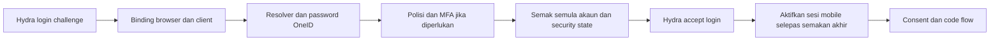

# Hasil Fasa B — adapter password dan MFA OneID

Tarikh: 29 September 2026. Skop: `/var/www/oneid-uat` sahaja.

**Adapter domain dan sambungan provider telah dibina serta diuji secara
terasing. Adapter belum diaktifkan pada laluan login sebenar.** Tiada commit
atau push Git. Tiada database aplikasi, `.env`, Nginx atau login web diubah.
Tiada akaun sebenar, SMTP sebenar atau konfigurasi rahsia OneID dibaca untuk
rehearsal Fasa B.

Ini sambungan kepada [Fasa A](Hasil-Fasa-A-OneID-Mobile-OIDC.md) dan
[dokumen induk analisis](Dokumen-Induk-Analisis-Teknikal-Kontrak-OneID-Mobile.md).
Ia tidak menggantikan gates pengaktifan, Flutter dan operasi dalam audit asal.

## Apa yang telah dibina

| Komponen | Tingkah laku |
|---|---|
| Resolver | No staf daripada `data3`; matrik daripada `data4`, fallback `u_id` jika matrik kosong. Identifier bertindih ditolak, tidak memilih rekod pertama |
| Kategori | Membership staff/student apabila tersedia; fallback kategori OneID staf 2/3 atau pelajar 10/11/12 bagi akaun manual. Tiada pendaftaran MyCampus atau ACL aplikasi tambahan |
| Password | Menggunakan `oneid_password_verify()` sedia ada: hash moden dan deadline MD5 legacy. Suspended/credential salah ditolak; default password atau flag forced-change menghalang code/token |
| Polisi MFA | Menggunakan `PdoUserMfaPolicyReader`: effective mode, runtime ceiling, kategori, pilot dan temporary exemption. Polisi disemak semula sebelum akses diterbitkan |
| OTP emel | Primitive OTP OneID, hash sahaja dalam state, TTL, cooldown, had penghantaran dan percubaan, invalidation OTP lama selepas resend, fail closed ketika delivery gagal |
| TOTP | Primitive cipher/keyring OneID; encrypted factor sedia ada dan atomic compare-and-swap `last_used_time_step` bagi menghalang replay merentas web/mobile |
| Provider | Hydra private login challenge/read/accept, client/callback allowlist, actual subject dan assurance; provider `skip` tidak dianggap bukti pengesahan |
| Sesi mobile | Subject rawak stabil, state berasingan, binding browser/client/challenge, expiry pending, completion sekali sahaja, security version, per-session revoke |
| Persistence | Source PDO dan state PDO berkongsi transaksi; schema additive disediakan, hanya diuji pada database fixture |
| Emel sebenar | `OneIdOtpDelivery` membalut sender interface OneID; ujian menggunakan sink dan tidak menghantar emel |

Semua kod baharu ada di [`app/Auth/MobileOidc`](../../app/Auth/MobileOidc/).
Komposisi, arahan ujian dan kontrak handler:
[`tools/mobile-oidc-adapter/README.md`](../../tools/mobile-oidc-adapter/README.md).

## Sempadan login dan perubahan keselamatan

Tidak memanggil `LegacyUserMfaLoginFinalizer`, tidak membuat token dalam
`token_tbl`, tidak menetapkan `sso_cre` atau membuka PHP session web. Adapter
mempunyai pending state sendiri; ia tidak mencipta pending MFA legacy yang
boleh tersalah diselesaikan melalui route web. Semakan policy/source dan
primitive kriptografi digunakan semula, orchestration mobile diasingkan.

Sebelum dan selepas panggilan provider, adapter menyemak semula akaun,
password state, kategori, polisi dan material factor. Jika akaun berubah
semasa network call, sesi mobile kekal tidak aktif. Hook operasi nanti wajib
menolak token bagi sesi yang tidak aktif ini. Unknown provider outcome
mengakhiri percubaan; tiada auto-retry penerimaan challenge.

Binding state menggunakan HMAC server key. Security stamp tidak dihantar ke
mobile/provider. Profile tidak mengandungi password, hash, IC, secret MFA,
role admin atau akses database. Data password diambil server-side untuk verify
sahaja; API membaca password tidak diwujudkan.

## Apa yang provider/mobile boleh gunakan nanti

Selepas authentication berjaya, adapter memberikan Hydra:

- `subject`: nilai `oneid_...` rawak daripada mapping, bukan no staf/matrik.
- `amr`: `pwd`, ditambah `email` bagi OTP emel atau `otp` bagi TOTP; ini
  vocabulary assurance adapter yang perlu didokumenkan dalam kontrak release.
- `acr`: `urn:oneid:pwd` atau `urn:oneid:pwd:mfa`.
- Context dalaman `mobile_sid`, `account_type` dan masa password authentication.

Fungsi status dalaman menyediakan `sub`, `account_type`, `name`, `amr` dan
`auth_time` selepas semakan sesi/client/source. Masa authentication asal tidak
dinaikkan hanya kerana semakan sesi dilakukan. `mobile_sid` ialah binding
dalaman server, bukan bukti login yang boleh dihantar oleh Flutter.

Consent handler Fasa C mesti memindahkan hanya claim yang dibenarkan ke token
session/profile. Discovery, PKCE, access/refresh token, JWKS dan userinfo kekal
tanggungjawab provider. URL HTTPS, client ID release, callback dan public
session endpoint belum diaktifkan atau diberikan sebagai kontrak live.

## Bukti pengujian

| Suite | Keputusan | Apa yang benar-benar diuji |
|---|---|---|
| Domain adapter | 73/73 | Fixture memory dengan verifier/hash/OTP/TOTP/cipher OneID sebenar; collision, manual/dwistatus, forced change, MFA, replay, rate limit, dependency/policy changes dan revocation |
| Real provider | 29/29 | PHP adapter → Hydra v26.2.0 → code PKCE → token; staf, pelajar OTP, TOTP, password salah dan OTP salah |
| Real SQL | 27/27 | MySQL 8.0.46 melalui private UNIX socket; native PDO, policy reader sebenar, transaksi/state persistence, replay counter CAS, rollback, factory dan sentinel token web |
| Regresi MFA lama | 33/33 | Suite primitive 8, pending coordinator 12, TOTP self-service 13; fixture sahaja |

Jumlah: **162 assertion lulus**. Ini bukan 162 ujian telefon atau ujian
pengguna sebenar. Bukti sanitised di [bukti-fasa-b](bukti-fasa-b/).
PHP lint dan Python AST disemak. Fail runtime legacy tracked tidak berubah.

Database MySQL fixture, database provider PostgreSQL dan semua servis ujian
telah dihentikan selepas rehearsal. Artifact peribadi di `.private/` diabaikan
Git. Schema baharu belum diaplikasikan pada database aplikasi OneID.

## Keputusan konservatif dan kerja sebelum pengaktifan

1. **Forced password change:** adapter menyekat penerbitan akses. Hosted UI
   untuk menukar password dalam konteks mobile, history/reuse checks dan
   menyambung semula authorization belum dibina. Jangan memintas flag ini.
2. **Admin-staf:** tiada role admin diberi kepada mobile. Adapter secara
   konservatif sentiasa memerlukan MFA bagi `u_type=1`, termasuk jika polisi
   user OFF; tiada factor bermakna tiada akses. Keputusan ini perlu disahkan
   dengan pemilik polisi sebelum release; bukan perubahan polisi web semasa.
3. **Lifecycle:** primitif security version/retire subject tersedia, tetapi
   reset/disable/delete/recreate/sync/recovery writers belum disambungkan
   secara atomik. Security stamp mengesan perubahan yang masih wujud; ia
   tidak cukup untuk disable→enable atau delete→recreate yang berlaku sepenuhnya
   di antara dua semakan. Gate lifecycle kekal terbuka sehingga writer/outbox
   integration diuji. Jangan aktifkan persistent mobile sessions sebelum itu.
4. **Rehash:** adapter menggunakan verifier legacy tetapi tidak menaik taraf
   hash secara senyap. Rehash algoritma dan perubahan password sebenar perlu
   dibezakan sebelum menghubungkan invalidation. Pada tahap ini perubahan
   hash akan menyebabkan security stamp lama tidak sepadan.
5. **Hosted HTTP:** belum ada controller login/CSRF/Origin, cookie mobile
   khusus, cancel/reject flow, consent handler, authenticated token hook atau
   bearer-validation session endpoint operasi. CLI fixture bukan endpoint.
6. **Operasi:** factory/readiness callback mesti menggunakan konfigurasi UAT
   sah; uji pengasingan DB, TLS/issuer, private admin network, retry/deadlock,
   contention mutex, audit retention/purge, backup/restore dan rollback sebelum
   route diaktifkan. Schema menggunakan mutex global yang disengajakan untuk
   pengasingan transaksi dormant, belum diperakui bagi beban operasi.
7. **Polisi sesi kekal dan Flutter:** TTL refresh release masih belum ditetapkan.
   Secure storage, single-flight refresh, offline, cold start dan deep links
   Android/iOS masih memerlukan integrasi Flutter. Adapter sahaja tidak
   menjamin sesi tanpa logout selepas berbulan tidak aktif.
8. **Regresi operasi:** 33 assertion lama dan fail tidak berubah bukan
   pengganti web/SSO/MyDigitalID end-to-end bersama adapter aktif. TOTP counter
   berkongsi memang perlu digunakan bagi replay protection apabila diaktifkan;
   ujian web + mobile dalam timestep sama perlu disertakan.

## Kedudukan selepas kerja ini

Fasa B menyediakan adapter terasing yang boleh digunakan untuk membina
deployment UAT dormant dalam Fasa C. Semakan domain, sambungan Hydra dan
query PDO telah dibuktikan pada fixture; tiada dakwaan login akaun sebenar
sudah live. Fasa C perlu memasang schema additive secara terkawal, menyediakan
hosted handlers dan menutup gate lifecycle/regresi sebelum aktivasi untuk
ujian Flutter. Semua perubahan seterusnya kekal **UAT sahaja**, dan Git tidak
boleh dipush tanpa kebenaran pengguna.
